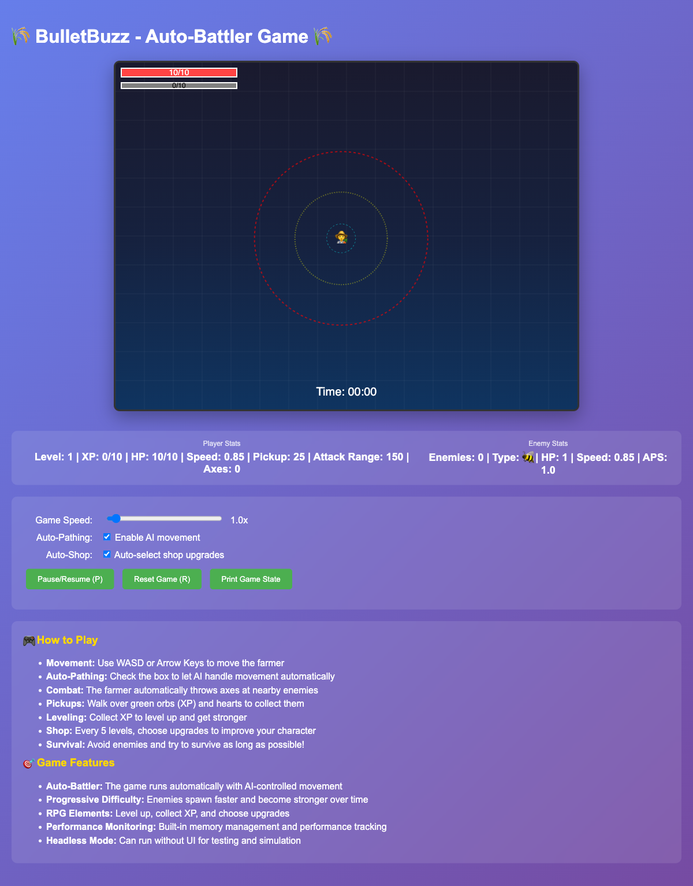

# 🎮 BulletBuzz - Bullet Heaven Game

A browser-based bullet heaven game inspired by Brotato and Vampire Survivors, featuring auto-pathing, combat mechanics, and headless simulation capabilities for balance testing.



## 🚀 Play Now

**[Play BulletBuzz on GitHub Pages](https://tjsingleton.github.io/bulletbuzz/)**

**🎮 Development Mode**: Add `?speed=10` to the URL for 10x game speed for faster testing!

## 🎯 Game Features

### 🧠 Advanced AI
- **Auto-Pathing**: Intelligent movement with wall avoidance and target tracking
- **Combat AI**: Smart targeting within attack range with automatic axe throwing
- **Pickup Attraction**: XP orbs and hearts attract to player within pickup range
- **Robot Vacuum Mode**: Efficient pickup collection with pathfinding to drops

### ⚔️ Gameplay Mechanics
- **Bullet Heaven**: Survive waves of enemies in an endless arena
- **XP System**: Level up to unlock new abilities with accurate progress tracking
- **Pickup System**: Collect hearts and XP drops with attraction mechanics
- **Shop System**: Choose upgrades between levels with auto-shop option
- **Difficulty Scaling**: Progressive challenge increase with dynamic spawn rates

### 🎨 Enhanced UI
- **Professional Shop Modal**: Button-like options with sequential numbering
- **Detailed Game Over Screen**: Comprehensive statistics with skull emoji
- **Real-time Stats**: Live player and enemy statistics
- **Range Visualization**: Attack and pickup range circles
- **XP Progress Bar**: Visual progress tracking

### 🛠️ Development Features
- **Headless Simulation**: Automated balance testing
- **Real-time Debugging**: Browser console tools
- **Parameter Adjustment**: Live game balance controls
- **Performance Monitoring**: Memory and performance tracking
- **URL Parameters**: Game speed control via URL
- **Automated Screenshots**: Playwright-based screenshot testing

## 🏗️ Architecture

### 📁 Project Structure
```
bulletbuzz/
├── src/
│   ├── BulletBuzzGame.ts    # Game API facade
│   ├── game-ui.ts           # UI rendering and controls
│   ├── types.ts             # TypeScript interfaces
│   ├── core/
│   │   ├── Game.ts          # Core game loop and state
│   │   ├── Player.ts        # Player AI and movement
│   │   ├── Enemy.ts         # Enemy behavior
│   │   ├── Axe.ts           # Projectile mechanics
│   │   ├── XpDrop.ts        # XP pickup with attraction
│   │   └── HeartDrop.ts     # Health pickup with attraction
│   └── systems/
│       ├── SpawnSystem.ts   # Enemy and pickup spawning
│       ├── CollisionSystem.ts # Collision detection
│       └── LevelSystem.ts   # Level progression and shop
├── dist/                    # Compiled JavaScript
├── tests/                   # Unit tests
├── scripts/                 # Utility scripts
│   └── screenshots.js       # Screenshot automation
├── .tmp/                    # Temporary files (screenshots)
├── index.html              # Game interface
├── test-runner.js          # Headless simulation
├── screenshot-test.js       # Basic screenshot testing
├── advanced-screenshots.js  # Advanced screenshot class
└── package.json            # Dependencies & scripts
```

### 🔧 Technology Stack
- **TypeScript**: Type-safe game development
- **HTML5 Canvas**: Game rendering
- **ES Modules**: Modern JavaScript modules
- **Node.js**: Headless testing environment
- **Jest**: Unit testing framework
- **Playwright**: Automated browser testing and screenshots

## 🚀 Quick Start

### Local Development
```bash
# Clone the repository
git clone https://github.com/tjsingleton/bulletbuzz.git
cd bulletbuzz

# Install dependencies
npm install

# Start development server
npm run dev

# Build for production
npm run build

# Run tests
npm test
```

### Game Speed Control
- **Development**: `http://localhost:XXXX/?speed=10` for 10x speed
- **Production**: `https://tjsingleton.github.io/bulletbuzz/` (1x speed)
- **Custom**: `?speed=X` where X is any positive number

### Testing
```bash
# Run headless simulation
node test-runner.js

# Test different configurations
node test-runner.js --test-configs

# Browser console debugging
# Open browser console and use: debugGame.logState()
```

### Screenshot Testing
```bash
# Basic screenshot test
npm run screenshots

# Advanced screenshot testing
npm run screenshots:advanced

# UI element screenshots
npm run screenshots:ui

# Speed test screenshots
npm run screenshots:speed

# Game state screenshots
npm run screenshots:game-states

# Game over screenshots
npm run screenshots:game-over

# All screenshot tests
npm run screenshots:all

# Clean up screenshots
npm run screenshots:clean

# Show available commands
npm run screenshots:help
```

## 🎮 Controls

### Game Controls
- **WASD/Arrow Keys**: Manual movement (optional)
- **P**: Pause/Unpause
- **R**: Reset game
- **1-5**: Shop selection (when shop is open)

### Auto-Features
- **Auto-Pathing**: Checkbox to enable/disable AI movement
- **Auto-Shop**: Checkbox to automatically select shop upgrades
- **Game Speed**: Slider to adjust game speed (0.1x to 20x)

### Debug Commands (Browser Console)
```javascript
debugGame.logState()        // Log current game state
debugGame.getMemory()       // Check memory usage
debugGame.logPerformance()  // Performance metrics
debugGame.reset()          // Reset game
debugGame.pause()          // Toggle pause
debugGame.spawnEnemy()     // Force spawn enemy
```

## 🧪 Testing & Balance

### Automated Testing
- **Unit Tests**: 28 comprehensive tests covering all systems
- **Headless Simulation**: Run thousands of games automatically
- **Balance Testing**: Test different parameter configurations
- **Performance Monitoring**: Track memory usage and performance
- **Regression Testing**: Ensure changes don't break existing functionality
- **Screenshot Testing**: Automated visual testing with Playwright

### Parameter Adjustment
Real-time adjustment of game balance via browser sliders:
- Player stats (HP, speed, pickup range, attack range)
- Enemy behavior (speed, spawn rate)
- Auto-pathing settings (avoidance, flee mechanics)
- Difficulty scaling (level progression)

## 📊 Game Balance

### Current Settings
- **Player**: 10 HP, 0.85 speed, 25 pickup range, 150 attack range
- **Enemies**: 0.15 speed, 8s spawn interval
- **Auto-Pathing**: 120 avoidance distance, 2.0 strength
- **Difficulty**: Single enemy until level 6, 15% scaling
- **Shop**: Appears after every level with 3 random options

### Balance Metrics
- **Success Rate**: % of runs reaching target level
- **Average Time**: Time to reach target level
- **Survival Rate**: % of runs where player survives
- **Performance**: Memory usage and frame rates

## 🔧 Development

### Building
```bash
# TypeScript compilation
npm run build

# Watch mode for development
npm run dev:watch

# Type checking only
npm run type-check
```

### Testing
```bash
# Run all tests
npm test

# Quick balance test
node test-runner.js --quick

# Configuration testing
node test-runner.js --test-configs

# Custom simulation
node test-runner.js --runs 10 --target 5 --time 300
```

### Screenshot Development
```bash
# Take screenshots during development
npm run screenshots:ui

# Test different game states
npm run screenshots:game-states

# Verify UI changes
npm run screenshots:all

# Clean up after testing
npm run screenshots:clean
```

## 📈 Performance

### Optimizations
- **Fixed Timestep**: Consistent game updates regardless of frame rate
- **Object Pooling**: Efficient memory management
- **Lifetime Tracking**: Automatic cleanup of temporary objects
- **Array Limits**: Prevent unbounded growth
- **Modular Architecture**: Clean separation of concerns

### Monitoring
- **Memory Usage**: Automatic warnings at 90% capacity
- **Performance Metrics**: Frame rate and update timing
- **Debug Tools**: Real-time state inspection

## 🎨 UI Features

### Shop System
- **Professional Modal**: Dark theme with button-like options
- **Sequential Numbering**: Options always numbered 1, 2, 3
- **Auto-Shop**: Automatic selection with checkbox control
- **Visual Feedback**: Clear instructions and hover effects

### Game Over Screen
- **Detailed Statistics**: Survival time, level reached, enemies killed
- **Performance Metrics**: Kill rate, XP efficiency
- **Visual Design**: Skull emoji and color-coded information
- **Professional Layout**: Modal with proper alignment

### Real-time UI
- **Live Stats**: Player and enemy statistics
- **Range Visualization**: Attack and pickup range circles
- **XP Progress**: Visual progress bar with current/required
- **Game Controls**: Speed slider, auto-pathing, auto-shop

## 📸 Screenshot Testing

### Automated Visual Testing
- **Playwright Integration**: Cross-browser screenshot testing
- **Game State Capture**: Screenshots at different game stages
- **UI Element Testing**: Pause, resume, auto-pathing states
- **Speed Testing**: Screenshots at different game speeds
- **Shop Testing**: Shop modal and auto-shop functionality
- **Game Over Testing**: Detailed statistics and modal screenshots

### Screenshot Features
- **Temporary Storage**: Screenshots stored in `.tmp/screenshots/`
- **Automatic Cleanup**: Old screenshots removed before new tests
- **Live-Server Ignored**: Screenshots don't trigger development reloads
- **Git Ignored**: Temporary files not tracked in version control
- **Timestamped Files**: Organized screenshots with timestamps
- **Full Page Capture**: Complete game interface screenshots

### Screenshot Commands
```bash
# Basic screenshot test
npm run screenshots

# Advanced screenshot testing
npm run screenshots:advanced

# UI element screenshots
npm run screenshots:ui

# Speed test screenshots
npm run screenshots:speed

# Game state screenshots
npm run screenshots:game-states

# Game over screenshots
npm run screenshots:game-over

# All screenshot tests
npm run screenshots:all

# Clean up screenshots
npm run screenshots:clean

# Show available commands
npm run screenshots:help
```

## 🤝 Contributing

1. Fork the repository
2. Create a feature branch (`git checkout -b feature/amazing-feature`)
3. Commit your changes (`git commit -m 'Add amazing feature'`)
4. Push to the branch (`git push origin feature/amazing-feature`)
5. Open a Pull Request

## 📝 License

This project is licensed under the ISC License - see the [LICENSE](LICENSE) file for details.

## 🎯 Roadmap

- [x] **Modular Architecture**: Clean separation of game systems
- [x] **Enhanced UI**: Professional shop and game over screens
- [x] **Auto-Shop**: Automatic upgrade selection
- [x] **Pickup Attraction**: XP and heart attraction mechanics
- [x] **URL Parameters**: Game speed control via URL
- [x] **Screenshot Testing**: Automated visual testing with Playwright
- [ ] **Multiplayer Support**: Real-time multiplayer battles
- [ ] **More Enemy Types**: Different enemy behaviors and abilities
- [ ] **Power-ups**: Temporary buffs and special abilities
- [ ] **Achievements**: Unlockable achievements and stats
- [ ] **Mobile Support**: Touch controls and mobile optimization
- [ ] **Sound Effects**: Audio feedback and music
- [ ] **Particle Effects**: Visual enhancements and feedback

## 🐛 Known Issues

- **Performance**: High enemy counts may impact frame rate
- **Balance**: Early game may be too easy for experienced players
- **Mobile**: Touch controls not yet implemented

## 📞 Support

- **Issues**: [GitHub Issues](https://github.com/tjsingleton/bulletbuzz/issues)
- **Discussions**: [GitHub Discussions](https://github.com/tjsingleton/bulletbuzz/discussions)
- **Wiki**: [Game Balance Wiki](https://github.com/tjsingleton/bulletbuzz/wiki)

---

**Made with ❤️ by [@tjsingleton](https://github.com/tjsingleton)**
