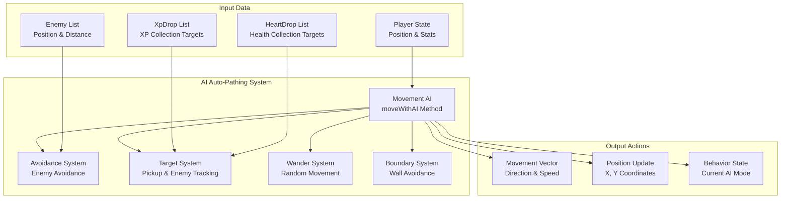
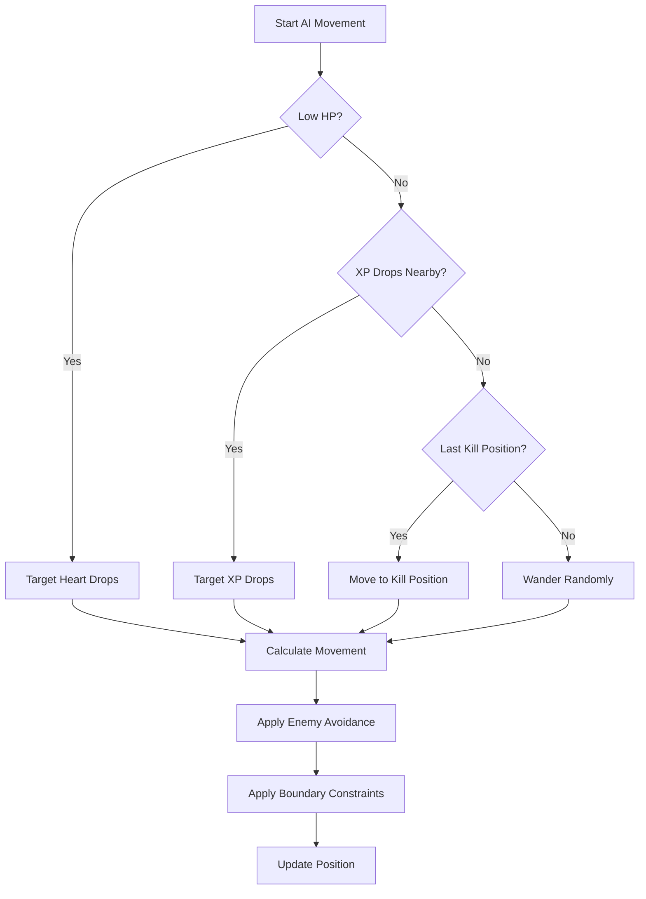

# AI Auto-Pathing

## 🎯 Overview

BulletBuzz features an advanced AI auto-pathing system that provides intelligent movement for the player character. The AI combines multiple behaviors including enemy avoidance, pickup collection, target tracking, and strategic positioning to create engaging and effective gameplay.

## 🏗️ Architecture

### Core Components



### Behavior Priority System

The AI uses a priority-based decision system:



## 🚀 Quick Start

### Basic Usage

```typescript
// AI movement is automatically called each frame
player.moveWithAI(enemies, xpDrops, heartDrops);
```

### Configuration

```typescript
// Configure AI behavior parameters
const config = {
  avoidanceDistance: 120,    // Distance to start avoiding enemies
  fleeDistance: 80,          // Distance to flee from enemies
  avoidanceStrength: 2.0,    // Strength of avoidance force
  fleeStrength: 1.5,         // Strength of flee force
  heartPriorityDistance: 100, // Distance to prioritize hearts
  xpCollectionDistance: 200,  // Distance to collect XP
  wanderInterval: 180,        // Frames between wander direction changes
  wanderDistance: 50         // Distance to wander
};
```

## 🧠 AI Behaviors

### 1. Enemy Avoidance

The AI actively avoids enemies using a repulsion force system:

```typescript
// Calculate avoidance vector from enemies
let avoidX = 0;
let avoidY = 0;

for (const enemy of enemies) {
  const distance = Math.sqrt((this.x - enemy.x) ** 2 + (this.y - enemy.y) ** 2);
  
  if (distance < 120) { // Avoidance distance
    const angle = Math.atan2(this.y - enemy.y, this.x - enemy.x);
    const strength = 2.0 * (1 - distance / 120);
    avoidX += Math.cos(angle) * strength;
    avoidY += Math.sin(angle) * strength;
  }
  
  if (distance < 80) { // Flee distance
    const angle = Math.atan2(this.y - enemy.y, this.x - enemy.x);
    const strength = 1.5 * (1 - distance / 80);
    avoidX += Math.cos(angle) * strength;
    avoidY += Math.sin(angle) * strength;
  }
}
```

**Parameters:**
- **Avoidance Distance**: 120 pixels - Distance to start avoiding enemies
- **Flee Distance**: 80 pixels - Distance to actively flee from enemies
- **Avoidance Strength**: 2.0 - Multiplier for avoidance force
- **Flee Strength**: 1.5 - Multiplier for flee force

### 2. Pickup Collection

The AI prioritizes different types of pickups based on game state:

```typescript
// Find closest XP drop
let closestXp: XpDrop | null = null;
let closestXpDistance = Infinity;

for (const xp of xpDrops) {
  const distance = Math.sqrt((this.x - xp.x) ** 2 + (this.y - xp.y) ** 2);
  if (distance < closestXpDistance) {
    closestXpDistance = distance;
    closestXp = xp;
  }
}

// Find closest heart drop
let closestHeart: HeartDrop | null = null;
let closestHeartDistance = Infinity;

for (const heart of heartDrops) {
  const distance = Math.sqrt((this.x - heart.x) ** 2 + (this.y - heart.y) ** 2);
  if (distance < closestHeartDistance) {
    closestHeartDistance = distance;
    closestHeart = heart;
  }
}
```

**Priority System:**
1. **Hearts** (when low HP) - Distance < 100 pixels
2. **XP Drops** - Distance < 200 pixels
3. **Last Kill Position** - Move to where enemy was killed
4. **Wander** - Random movement when no targets

### 3. Target Tracking

The AI remembers the last killed enemy position for efficient pickup collection:

```typescript
// Set last killed enemy position for pathfinding
public setLastKilledEnemy(x: number, y: number): void {
  this.lastKilledEnemy = { x, y };
}

// Move toward last killed enemy position
if (this.lastKilledEnemy) {
  targetX = this.lastKilledEnemy.x;
  targetY = this.lastKilledEnemy.y;
  
  // Clear lastKilledEnemy if we're close to it
  const distanceToLastKill = Math.sqrt(
    (this.x - this.lastKilledEnemy.x) ** 2 + 
    (this.y - this.lastKilledEnemy.y) ** 2
  );
  if (distanceToLastKill < 30) {
    this.lastKilledEnemy = null;
  }
}
```

### 4. Wander Behavior

When no immediate targets exist, the AI wanders randomly:

```typescript
// Wander randomly
this.wanderTimer++;
if (this.wanderTimer > this.wanderInterval) {
  this.wanderDirection = Math.random() * 2 * Math.PI;
  this.wanderTimer = 0;
}
targetX = this.x + Math.cos(this.wanderDirection) * 50;
targetY = this.y + Math.sin(this.wanderDirection) * 50;
```

**Parameters:**
- **Wander Interval**: 180 frames - Time between direction changes
- **Wander Distance**: 50 pixels - Distance to move in wander direction

### 5. Boundary Avoidance

The AI ensures the player stays within the game boundaries:

```typescript
// Keep within bounds
this.x = Math.max(this.radius, Math.min(this.canvasWidth - this.radius, this.x));
this.y = Math.max(this.radius, Math.min(this.canvasHeight - this.radius, this.y));
```

## 📊 Movement Calculation

### Vector Combination

The AI combines multiple movement vectors:

```typescript
// Calculate movement direction
let moveX = targetX - this.x;
let moveY = targetY - this.y;

// Apply avoidance
moveX += avoidX;
moveY += avoidY;

// Normalize and apply speed
const distance = Math.sqrt(moveX ** 2 + moveY ** 2);
if (distance > 0) {
  moveX = (moveX / distance) * this.speed;
  moveY = (moveY / distance) * this.speed;
}

// Update position
this.x += moveX;
this.y += moveY;
```

### Movement Flow

1. **Calculate Target Vector** - Direction to current target
2. **Apply Avoidance Vector** - Repulsion from enemies
3. **Normalize Combined Vector** - Ensure consistent speed
4. **Apply Player Speed** - Scale to player's movement speed
5. **Update Position** - Move player to new position
6. **Apply Boundaries** - Keep within canvas bounds

## ⚙️ Configuration Options

### AI Parameters

| Parameter | Default | Description | Impact |
|-----------|---------|-------------|--------|
| `avoidanceDistance` | 120 | Distance to start avoiding enemies | Higher = more cautious |
| `fleeDistance` | 80 | Distance to flee from enemies | Higher = more defensive |
| `avoidanceStrength` | 2.0 | Strength of avoidance force | Higher = stronger avoidance |
| `fleeStrength` | 1.5 | Strength of flee force | Higher = faster fleeing |
| `heartPriorityDistance` | 100 | Distance to prioritize hearts | Higher = more aggressive healing |
| `xpCollectionDistance` | 200 | Distance to collect XP | Higher = more XP collection |
| `wanderInterval` | 180 | Frames between wander changes | Higher = more stable movement |
| `wanderDistance` | 50 | Distance to wander | Higher = more exploration |

### Player Stats Impact

| Stat | Impact on AI |
|------|-------------|
| **Speed** | Affects movement velocity |
| **Pickup Range** | Determines automatic pickup distance |
| **Attack Range** | Affects combat positioning |
| **HP** | Influences heart collection priority |

## 🧪 Testing

### Unit Tests

```typescript
// Test enemy avoidance
test('player avoids enemies', () => {
  const player = new Player();
  const enemy = new Enemy(100, 100);
  
  player.moveWithAI([enemy], [], []);
  
  // Player should move away from enemy
  expect(player.x).not.toBe(100);
  expect(player.y).not.toBe(100);
});

// Test pickup collection
test('player moves toward XP drops', () => {
  const player = new Player();
  const xpDrop = new XpDrop(200, 200);
  
  player.moveWithAI([], [xpDrop], []);
  
  // Player should move toward XP drop
  expect(player.x).toBeGreaterThan(0);
  expect(player.y).toBeGreaterThan(0);
});
```

### Integration Tests

```typescript
// Test complete AI behavior
test('AI prioritizes hearts when low HP', () => {
  const game = new Game();
  const player = game.player;
  const heartDrop = new HeartDrop(100, 100);
  
  // Set player to low HP
  player.hp = 3;
  
  game.update(1/60);
  
  // Player should move toward heart
  expect(player.x).toBeCloseTo(100, 1);
  expect(player.y).toBeCloseTo(100, 1);
});
```

### Performance Testing

```typescript
// Test AI performance with many enemies
test('AI performance with 100 enemies', () => {
  const player = new Player();
  const enemies = Array.from({ length: 100 }, () => 
    new Enemy(Math.random() * 800, Math.random() * 600)
  );
  
  const startTime = performance.now();
  player.moveWithAI(enemies, [], []);
  const endTime = performance.now();
  
  // Should complete within reasonable time
  expect(endTime - startTime).toBeLessThan(1); // 1ms
});
```

## 🐛 Troubleshooting

### Common Issues

#### **Player Gets Stuck**
```typescript
// Check if avoidance forces are too strong
if (Math.abs(avoidX) > 10 || Math.abs(avoidY) > 10) {
  console.log('Avoidance forces too strong:', { avoidX, avoidY });
}
```

#### **Player Moves Erratically**
```typescript
// Check wander timer and direction
console.log('Wander state:', {
  timer: this.wanderTimer,
  direction: this.wanderDirection,
  interval: this.wanderInterval
});
```

#### **Player Ignores Pickups**
```typescript
// Check pickup detection distances
console.log('Pickup distances:', {
  closestXpDistance,
  closestHeartDistance,
  heartPriorityDistance: 100,
  xpCollectionDistance: 200
});
```

### Debug Mode

```typescript
// Enable AI debug mode
const DEBUG_AI = true;

if (DEBUG_AI) {
  console.log('AI Movement Debug:', {
    target: { x: targetX, y: targetY },
    avoidance: { x: avoidX, y: avoidY },
    finalMovement: { x: moveX, y: moveY },
    enemies: enemies.length,
    xpDrops: xpDrops.length,
    heartDrops: heartDrops.length
  });
}
```

## 🎯 Performance Optimization

### Optimization Strategies

1. **Distance Caching**
   ```typescript
   // Cache distance calculations
   const enemyDistances = enemies.map(enemy => ({
     enemy,
     distance: Math.sqrt((this.x - enemy.x) ** 2 + (this.y - enemy.y) ** 2)
   }));
   ```

2. **Early Exit Conditions**
   ```typescript
   // Skip processing if no enemies nearby
   if (enemies.length === 0) {
     return;
   }
   ```

3. **Spatial Partitioning**
   ```typescript
   // Only process enemies within reasonable distance
   const nearbyEnemies = enemies.filter(enemy => {
     const distance = Math.sqrt((this.x - enemy.x) ** 2 + (this.y - enemy.y) ** 2);
     return distance < 200; // Only process enemies within 200 pixels
   });
   ```

### Performance Metrics

- **Target**: < 0.1ms per frame for AI calculations
- **Memory**: Minimal object allocation during AI updates
- **CPU**: Efficient distance calculations and vector operations

## 🔮 Future Enhancements

### Planned Features

- [ ] **Pathfinding Algorithms** - A* pathfinding for complex scenarios
- [ ] **Formation Movement** - Coordinated movement patterns
- [ ] **Tactical Positioning** - Strategic positioning based on game state
- [ ] **Learning AI** - Adaptive behavior based on player patterns
- [ ] **Multi-Target Optimization** - Efficient handling of multiple objectives

### Technical Debt

- [ ] **TypeScript Types** - Better type definitions for AI parameters
- [ ] **Unit Tests** - Comprehensive test coverage for AI behaviors
- [ ] **Performance Monitoring** - Real-time AI performance metrics
- [ ] **Configuration System** - Runtime AI parameter adjustment

## 📚 Related Documentation

- [**Mobile Controls**](mobile-controls.md) - Touch-based movement controls
- [**Combat System**](combat-system.md) - Combat AI and targeting
- [**Pickup System**](pickup-system.md) - XP and heart collection mechanics
- [**Event System**](event-system.md) - Event-driven architecture
- [**Performance Guide**](../development/performance.md) - Optimization techniques

## 🎯 Best Practices

### AI Design Principles

1. **Predictable Behavior** - AI should be understandable to players
2. **Responsive Movement** - Quick reactions to changing situations
3. **Efficient Pathfinding** - Smart route selection
4. **Balanced Aggression** - Appropriate risk-taking behavior
5. **Performance Conscious** - Fast execution without lag

### Configuration Guidelines

1. **Start Conservative** - Begin with lower avoidance distances
2. **Test Extensively** - Validate AI behavior across different scenarios
3. **Monitor Performance** - Ensure AI doesn't impact frame rate
4. **Balance Gameplay** - AI should enhance, not dominate gameplay
5. **Document Changes** - Keep track of parameter adjustments

---

*Last updated: 2025-07-31*
*AI Version: 1.0* 