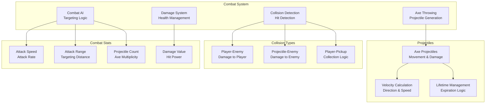
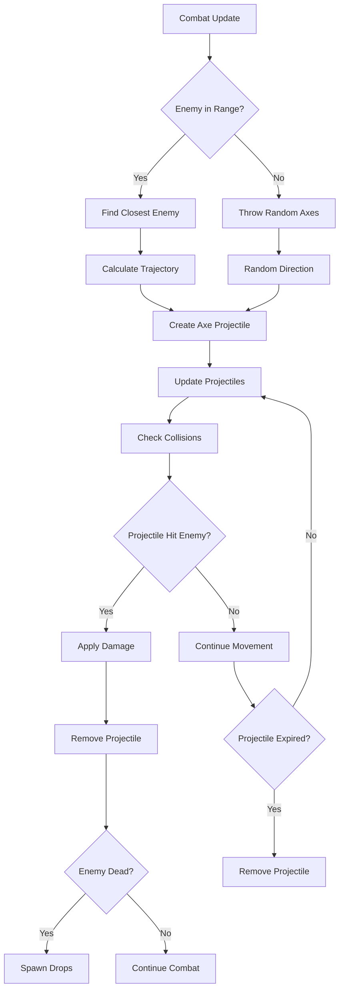

# Combat System

## 🎯 Overview

BulletBuzz features a dynamic combat system centered around automatic axe throwing, collision detection, and damage mechanics. The combat system provides engaging gameplay with intelligent targeting, projectile management, and responsive feedback.

## 🏗️ Architecture

### Core Components



### Combat Flow



## 🚀 Quick Start

### Basic Usage

```typescript
// Combat is automatically handled each frame
game.update(1/60);

// Manual axe throwing (for testing)
const axe = new Axe(player.x, player.y, targetX, targetY, speed, damage);
game.axes.push(axe);

// Check collision manually
const distance = Math.sqrt((axe.x - enemy.x) ** 2 + (axe.y - enemy.y) ** 2);
if (distance < axe.radius + enemy.radius) {
  enemy.takeDamage(axe.damage);
}
```

### Combat Configuration

```typescript
// Combat parameters
const combatConfig = {
  attackSpeed: 1.0,        // Attacks per second
  attackRange: 150,        // Targeting distance
  projectileCount: 1,      // Axes per attack
  projectileSpeed: 200,    // Axe movement speed
  damage: 1,               // Damage per axe
  lifetime: 2.0           // Axe lifetime in seconds
};
```

## ⚔️ Combat Mechanics

### 1. Axe Throwing

The combat system automatically throws axes at nearby enemies:

```typescript
private throwAxes(): void {
  const player = this.game.player;
  
  // Find closest enemy within attack range
  let closestEnemy = null;
  let closestDistance = Infinity;
  
  for (const enemy of this.game.enemies) {
    const distance = Math.sqrt((player.x - enemy.x) ** 2 + (player.y - enemy.y) ** 2);
    if (distance < this.game.attackRange && distance < closestDistance) {
      closestDistance = distance;
      closestEnemy = enemy;
    }
  }
  
  if (closestEnemy) {
    // Throw multiple axes based on projectile count
    for (let i = 0; i < this.game.projectileCount; i++) {
      const axe = new Axe(
        player.x,
        player.y,
        closestEnemy.x,
        closestEnemy.y,
        this.game.projectileSpeed,
        1
      );
      this.game.axes.push(axe);
      this.game.axesThrown++;
    }
  } else {
    // Throw random axes for visual feedback when no enemies are in range
    for (let i = 0; i < this.game.projectileCount; i++) {
      const randomAngle = Math.random() * Math.PI * 2;
      const randomDistance = 50 + Math.random() * 100;
      const targetX = player.x + Math.cos(randomAngle) * randomDistance;
      const targetY = player.y + Math.sin(randomAngle) * randomDistance;
      
      const axe = new Axe(
        player.x,
        player.y,
        targetX,
        targetY,
        this.game.projectileSpeed,
        1
      );
      this.game.axes.push(axe);
      this.game.axesThrown++;
    }
  }
}
```

### 2. Axe Projectiles

Axe projectiles have movement, lifetime, and collision properties:

```typescript
export class Axe implements AxeType {
  public x: number;
  public y: number;
  public radius: number;
  public speed: number;
  public damage: number;
  public lifetime: number;
  public color: string;
  
  // Movement
  private velocityX: number;
  private velocityY: number;
  
  constructor(x: number, y: number, targetX: number, targetY: number, speed: number, damage: number) {
    this.x = x;
    this.y = y;
    this.radius = 6;
    this.speed = speed;
    this.damage = damage;
    this.lifetime = 2.0; // 2 seconds
    this.color = '#8B4513'; // Brown color
    
    // Calculate velocity toward target
    const dx = targetX - x;
    const dy = targetY - y;
    const distance = Math.sqrt(dx * dx + dy * dy);
    
    if (distance > 0) {
      this.velocityX = (dx / distance) * speed;
      this.velocityY = (dy / distance) * speed;
    } else {
      this.velocityX = 0;
      this.velocityY = speed;
    }
  }
}
```

### 3. Collision Detection

The collision system handles multiple types of interactions:

```typescript
public update(): void {
  this.checkPlayerEnemyCollisions();
  this.checkPlayerPickupCollisions();
  this.checkProjectileEnemyCollisions();
  this.updateEnemyTargets();
}
```

#### **Player-Enemy Collisions**

```typescript
private checkPlayerEnemyCollisions(): void {
  const player = this.game.player;
  
  for (const enemy of this.game.enemies) {
    if (enemy.collidesWithPlayer(player) && player.hitTimer <= 0) {
      player.takeDamage(enemy.damage);
    }
  }
}
```

#### **Projectile-Enemy Collisions**

```typescript
private checkProjectileEnemyCollisions(): void {
  for (let i = this.game.axes.length - 1; i >= 0; i--) {
    const axe = this.game.axes[i];
    
    for (let j = this.game.enemies.length - 1; j >= 0; j--) {
      const enemy = this.game.enemies[j];
      const distance = Math.sqrt((axe.x - enemy.x) ** 2 + (axe.y - enemy.y) ** 2);
      
      if (distance < axe.radius + enemy.radius) {
        // Hit enemy
        enemy.takeDamage(axe.damage);
        
        // Remove axe
        this.game.axes.splice(i, 1);
        
        // Check if enemy died
        if (enemy.isDead()) {
          // Spawn drops at enemy location
          this.game.spawnSystem.spawnXpDrop(enemy.x, enemy.y, enemy.xpValue);
          this.game.spawnSystem.spawnHeartDrop(enemy.x, enemy.y);
          
          // Set last killed enemy position for player pathfinding
          this.game.player.setLastKilledEnemy(enemy.x, enemy.y);
          
          // Remove enemy
          this.game.enemies.splice(j, 1);
          this.game.enemiesKilled++;
        }
        
        break; // Axe can only hit one enemy
      }
    }
  }
}
```

### 4. Damage System

Damage is applied through a simple but effective system:

```typescript
// Enemy takes damage
public takeDamage(damage: number): void {
  this.hp = Math.max(0, this.hp - damage);
}

// Player takes damage
public takeDamage(damage: number): void {
  this.hp = Math.max(0, this.hp - damage);
  this.hitTimer = 0.5; // Invulnerability time
}
```

## 🎯 Combat AI

### 1. Targeting Logic

The combat AI uses intelligent targeting:

```typescript
// Find closest enemy within attack range
let closestEnemy = null;
let closestDistance = Infinity;

for (const enemy of this.game.enemies) {
  const distance = Math.sqrt((player.x - enemy.x) ** 2 + (player.y - enemy.y) ** 2);
  if (distance < this.game.attackRange && distance < closestDistance) {
    closestDistance = distance;
    closestEnemy = enemy;
  }
}
```

### 2. Attack Timing

Attacks are controlled by a timer system:

```typescript
private handleAutomaticAttacks(): void {
  this.attackTimer += this.game.timestep;
  
  const attackInterval = 1.0 / this.game.attackSpeed;
  
  if (this.attackTimer >= attackInterval) {
    this.throwAxes();
    this.attackTimer = 0;
  }
}
```

### 3. Visual Feedback

When no enemies are in range, axes are thrown randomly for visual feedback:

```typescript
// Throw random axes for visual feedback when no enemies are in range
for (let i = 0; i < this.game.projectileCount; i++) {
  const randomAngle = Math.random() * Math.PI * 2;
  const randomDistance = 50 + Math.random() * 100;
  const targetX = player.x + Math.cos(randomAngle) * randomDistance;
  const targetY = player.y + Math.sin(randomAngle) * randomDistance;
  
  const axe = new Axe(
    player.x,
    player.y,
    targetX,
    targetY,
    this.game.projectileSpeed,
    1
  );
  this.game.axes.push(axe);
  this.game.axesThrown++;
}
```

## 📊 Combat Statistics

### Combat Parameters

| Parameter | Default | Description | Impact |
|-----------|---------|-------------|--------|
| `attackSpeed` | 1.0 | Attacks per second | Higher = more frequent attacks |
| `attackRange` | 150 | Targeting distance | Higher = longer range attacks |
| `projectileCount` | 1 | Axes per attack | Higher = more damage output |
| `projectileSpeed` | 200 | Axe movement speed | Higher = faster projectiles |
| `damage` | 1 | Damage per axe | Higher = more damage per hit |
| `lifetime` | 2.0 | Axe lifetime in seconds | Higher = longer projectile life |

### Combat Stats Tracking

```typescript
// Combat statistics
this.game.axesThrown++;        // Total axes thrown
this.game.enemiesKilled++;     // Total enemies killed
this.game.xpCollected += value; // XP collected from kills
this.game.heartsCollected++;   // Hearts collected from kills
```

## 🎨 Visual Rendering

### Axe Rendering

```typescript
// Draw axe projectiles
for (const axe of this.game.axes) {
  ctx.fillStyle = axe.color;
  ctx.beginPath();
  ctx.arc(axe.x, axe.y, axe.radius, 0, 2 * Math.PI);
  ctx.fill();
  
  // Optional: Add trail effect
  ctx.strokeStyle = axe.color;
  ctx.lineWidth = 2;
  ctx.beginPath();
  ctx.moveTo(axe.x, axe.y);
  ctx.lineTo(axe.x - axe.velocityX * 0.1, axe.y - axe.velocityY * 0.1);
  ctx.stroke();
}
```

### Combat Effects

```typescript
// Draw attack range indicator
ctx.strokeStyle = 'rgba(255, 255, 255, 0.3)';
ctx.lineWidth = 1;
ctx.beginPath();
ctx.arc(player.x, player.y, this.game.attackRange, 0, 2 * Math.PI);
ctx.stroke();
```

## ⚙️ Configuration Options

### Combat Parameters

| Parameter | Base Value | Increment | Max Value | Effect |
|-----------|------------|-----------|-----------|--------|
| **Attack Speed** | 1.0 | +0.2 | No limit | Attack frequency |
| **Attack Range** | 150 | +5 | No limit | Targeting distance |
| **Projectile Count** | 1 | +1 | No limit | Damage output |
| **Projectile Speed** | 200 | +10 | No limit | Projectile velocity |
| **Damage** | 1 | +1 | No limit | Damage per hit |

### Enemy Combat Stats

| Enemy Type | HP | Damage | Speed | XP Value |
|------------|----|--------|-------|----------|
| **Bee** | 1 | 1 | 0.15 | 10 |
| **Wasp** | 2 | 2 | 0.2 | 15 |

## 🧪 Testing

### Unit Tests

```typescript
// Test axe creation and movement
test('axe moves toward target', () => {
  const axe = new Axe(100, 100, 200, 200, 100, 1);
  const initialX = axe.x;
  const initialY = axe.y;
  
  axe.update(0.1);
  
  expect(axe.x).toBeGreaterThan(initialX);
  expect(axe.y).toBeGreaterThan(initialY);
});

// Test collision detection
test('axe hits enemy on collision', () => {
  const axe = new Axe(100, 100, 200, 200, 100, 1);
  const enemy = new Enemy(150, 150);
  const initialHp = enemy.hp;
  
  // Move axe to enemy position
  axe.x = 150;
  axe.y = 150;
  
  // Simulate collision
  const distance = Math.sqrt((axe.x - enemy.x) ** 2 + (axe.y - enemy.y) ** 2);
  if (distance < axe.radius + enemy.radius) {
    enemy.takeDamage(axe.damage);
  }
  
  expect(enemy.hp).toBe(initialHp - axe.damage);
});

// Test attack timing
test('attacks occur at correct intervals', () => {
  const game = new Game();
  const initialAxeCount = game.axes.length;
  
  // Wait for one attack interval
  game.update(1.0 / game.attackSpeed);
  
  expect(game.axes.length).toBeGreaterThan(initialAxeCount);
});
```

### Integration Tests

```typescript
// Test complete combat flow
test('enemy dies when hit by axe', () => {
  const game = new Game();
  const enemy = new Enemy(150, 150);
  game.enemies.push(enemy);
  
  // Create axe at enemy position
  const axe = new Axe(100, 100, enemy.x, enemy.y, 200, 1);
  axe.x = enemy.x;
  axe.y = enemy.y;
  game.axes.push(axe);
  
  // Update collision system
  game.collisionSystem.update();
  
  expect(enemy.isDead()).toBe(true);
  expect(game.enemies.length).toBe(0);
  expect(game.axes.length).toBe(0);
});

// Test combat statistics
test('combat stats are tracked correctly', () => {
  const game = new Game();
  const initialStats = {
    axesThrown: game.axesThrown,
    enemiesKilled: game.enemiesKilled
  };
  
  // Simulate combat
  game.update(1/60);
  
  expect(game.axesThrown).toBeGreaterThanOrEqual(initialStats.axesThrown);
});
```

### Performance Tests

```typescript
// Test combat performance with many projectiles
test('combat performance with 100 axes', () => {
  const game = new Game();
  
  // Create 100 axes
  for (let i = 0; i < 100; i++) {
    const axe = new Axe(100, 100, 200, 200, 100, 1);
    game.axes.push(axe);
  }
  
  const startTime = performance.now();
  game.collisionSystem.update();
  const endTime = performance.now();
  
  // Should complete within reasonable time
  expect(endTime - startTime).toBeLessThan(1); // 1ms
});
```

## 🐛 Troubleshooting

### Common Issues

#### **Axes Not Hitting Enemies**
```typescript
// Check collision detection
console.log('Collision check:', {
  axePosition: { x: axe.x, y: axe.y },
  enemyPosition: { x: enemy.x, y: enemy.y },
  distance: Math.sqrt((axe.x - enemy.x) ** 2 + (axe.y - enemy.y) ** 2),
  collisionDistance: axe.radius + enemy.radius
});
```

#### **Attack Speed Issues**
```typescript
// Check attack timing
console.log('Attack timing:', {
  attackTimer: this.attackTimer,
  attackInterval: 1.0 / this.game.attackSpeed,
  shouldAttack: this.attackTimer >= (1.0 / this.game.attackSpeed)
});
```

#### **Projectiles Not Moving**
```typescript
// Check projectile velocity
console.log('Projectile velocity:', {
  velocityX: axe.velocityX,
  velocityY: axe.velocityY,
  speed: axe.speed,
  target: { x: targetX, y: targetY }
});
```

### Debug Mode

```typescript
// Enable combat debug mode
const DEBUG_COMBAT = true;

if (DEBUG_COMBAT) {
  console.log('Combat Debug:', {
    axesCount: this.game.axes.length,
    enemiesCount: this.game.enemies.length,
    attackTimer: this.attackTimer,
    attackSpeed: this.game.attackSpeed,
    attackRange: this.game.attackRange
  });
}
```

## 🎯 Performance Optimization

### Optimization Strategies

1. **Spatial Partitioning**
   ```typescript
   // Only check collisions for nearby entities
   const nearbyEnemies = enemies.filter(enemy => {
     const distance = Math.sqrt((axe.x - enemy.x) ** 2 + (axe.y - enemy.y) ** 2);
     return distance < 200; // Only check enemies within 200 pixels
   });
   ```

2. **Object Pooling**
   ```typescript
   // Reuse axe objects instead of creating new ones
   class AxePool {
     private pool: Axe[] = [];
     
     getAxe(): Axe {
       return this.pool.pop() || new Axe(0, 0, 0, 0, 0, 0);
     }
     
     returnAxe(axe: Axe): void {
       this.pool.push(axe);
     }
   }
   ```

3. **Efficient Collision Detection**
   ```typescript
   // Use squared distance to avoid square root
   const dx = axe.x - enemy.x;
   const dy = axe.y - enemy.y;
   const distanceSquared = dx * dx + dy * dy;
   const collisionDistanceSquared = (axe.radius + enemy.radius) ** 2;
   
   if (distanceSquared < collisionDistanceSquared) {
     // Collision detected
   }
   ```

### Performance Metrics

- **Combat Update Time**: < 0.1ms per frame
- **Collision Detection**: < 0.05ms per frame
- **Projectile Updates**: < 0.02ms per projectile
- **Memory Usage**: Minimal object allocation

## 🔮 Future Enhancements

### Planned Features

- [ ] **Multiple Weapon Types** - Different projectile types
- [ ] **Combo System** - Chained attack bonuses
- [ ] **Critical Hits** - Random critical damage
- [ ] **Area Effects** - Explosive and area damage
- [ ] **Weapon Switching** - Multiple weapon types

### Technical Debt

- [ ] **TypeScript Types** - Better type definitions for combat entities
- [ ] **Unit Tests** - Comprehensive test coverage for combat mechanics
- [ ] **Performance Monitoring** - Real-time combat performance metrics
- [ ] **Configuration System** - Runtime combat parameter adjustment

## 📚 Related Documentation

- [**AI Auto-Pathing**](ai-auto-pathing.md) - Movement and positioning
- [**Shop System**](shop-system.md) - Combat upgrades
- [**Enemy System**](enemy-system.md) - Enemy behavior and stats
- [**Pickup System**](pickup-system.md) - XP and heart collection
- [**Event System**](event-system.md) - Combat event handling

## 🎯 Best Practices

### Combat Design Principles

1. **Responsive Feedback** - Immediate visual and audio feedback
2. **Balanced Damage** - Appropriate damage scaling
3. **Clear Targeting** - Obvious attack indicators
4. **Performance Conscious** - Efficient collision detection
5. **Accessible Controls** - Multiple input methods

### Configuration Guidelines

1. **Start Conservative** - Begin with lower damage values
2. **Test Balance** - Ensure combat is engaging but not overwhelming
3. **Monitor Performance** - Track frame rate during intense combat
4. **Iterate Design** - Refine based on player feedback
5. **Document Changes** - Keep track of combat adjustments

---

*Last updated: 2025-07-31*
*Combat Version: 1.0* 