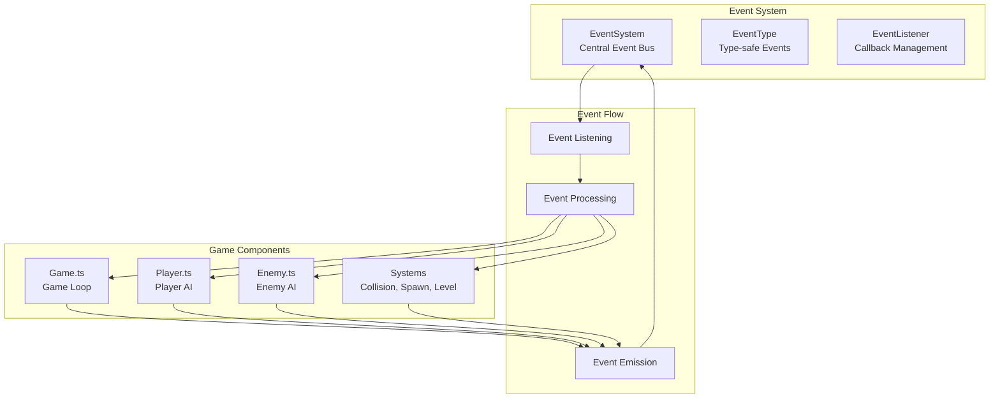

# Event System

## 🎯 Overview

The Event System provides a decoupled, event-driven architecture for BulletBuzz, allowing game components to communicate without direct dependencies. This improves code maintainability, testability, and enables powerful features like analytics, debugging, and modding.

## 🏗️ Architecture

### Core Components



## 🚀 Quick Start

### Basic Usage

```typescript
import { EventSystem, EventType } from '../src/events/EventSystem';

// Subscribe to events
EventSystem.on(EventType.ENEMY_KILLED, (data) => {
  console.log(`Enemy killed: ${data.enemyType}`);
});

// Emit events
EventSystem.emit(EventType.ENEMY_KILLED, {
  enemyType: 'bee',
  x: 100,
  y: 200,
  level: 1,
  xpValue: 10
});
```

### One-time Listeners

```typescript
// Listen for an event only once
EventSystem.once(EventType.GAME_STARTED, () => {
  console.log('Game started!');
});
```

## 📋 Event Types

### Combat Events

| Event | Description | Data Structure |
|-------|-------------|----------------|
| `ENEMY_KILLED` | Enemy defeated by player | `EnemyKilledEvent` |
| `PLAYER_DAMAGED` | Player takes damage | `PlayerDamagedEvent` |
| `AXE_THROWN` | Player throws an axe | `{ x: number, y: number }` |
| `AXE_HIT` | Axe hits an enemy | `{ enemyType: string, damage: number }` |

### Pickup Events

| Event | Description | Data Structure |
|-------|-------------|----------------|
| `XP_COLLECTED` | Player collects XP | `XpCollectedEvent` |
| `HEART_COLLECTED` | Player collects health | `{ amount: number }` |
| `PICKUP_SPAWNED` | Pickup item spawned | `{ type: string, x: number, y: number }` |

### Level Events

| Event | Description | Data Structure |
|-------|-------------|----------------|
| `LEVEL_UP` | Player gains a level | `LevelUpEvent` |
| `SHOP_OPENED` | Shop modal appears | `{ upgrades: string[] }` |
| `SHOP_CLOSED` | Shop modal closes | `{ selectedUpgrade?: string }` |
| `UPGRADE_SELECTED` | Player selects upgrade | `{ upgrade: string }` |

### Game State Events

| Event | Description | Data Structure |
|-------|-------------|----------------|
| `GAME_STARTED` | Game begins | `undefined` |
| `GAME_OVER` | Game ends | `GameOverEvent` |
| `GAME_PAUSED` | Game paused | `undefined` |
| `GAME_RESUMED` | Game resumed | `undefined` |

### Performance Events

| Event | Description | Data Structure |
|-------|-------------|----------------|
| `PERFORMANCE_WARNING` | Performance issues detected | `{ fps: number, memory: number }` |
| `MEMORY_WARNING` | Memory usage high | `{ usage: number, limit: number }` |

### Spawn Events

| Event | Description | Data Structure |
|-------|-------------|----------------|
| `ENEMY_SPAWNED` | New enemy appears | `{ type: string, x: number, y: number }` |
| `WAVE_STARTED` | New wave begins | `{ waveNumber: number }` |
| `WAVE_COMPLETED` | Wave finished | `{ waveNumber: number, enemiesKilled: number }` |

## 🔧 API Reference

### EventSystem Class

#### `EventSystem.on(eventType, callback, once?)`
Subscribe to an event.

**Parameters:**
- `eventType: EventType` - The event type to listen for
- `callback: (data?: any) => void` - Function to call when event occurs
- `once?: boolean` - If true, listener is removed after first call

**Returns:** `string` - Listener ID for unsubscribing

**Example:**
```typescript
const listenerId = EventSystem.on(EventType.ENEMY_KILLED, (data) => {
  console.log(`Enemy killed at ${data.x}, ${data.y}`);
});
```

#### `EventSystem.once(eventType, callback)`
Subscribe to an event once (auto-removes after first call).

**Parameters:**
- `eventType: EventType` - The event type to listen for
- `callback: (data?: any) => void` - Function to call when event occurs

**Returns:** `string` - Listener ID for unsubscribing

**Example:**
```typescript
EventSystem.once(EventType.GAME_STARTED, () => {
  console.log('Game started!');
});
```

#### `EventSystem.emit(eventType, data?)`
Emit an event to all listeners.

**Parameters:**
- `eventType: EventType` - The event type to emit
- `data?: any` - Optional data to pass to listeners

**Example:**
```typescript
EventSystem.emit(EventType.ENEMY_KILLED, {
  enemyType: 'bee',
  x: 100,
  y: 200,
  level: 1,
  xpValue: 10
});
```

#### `EventSystem.off(eventType, listenerId)`
Unsubscribe from an event.

**Parameters:**
- `eventType: EventType` - The event type
- `listenerId: string` - The listener ID returned from `on()` or `once()`

**Returns:** `boolean` - True if listener was removed

**Example:**
```typescript
const listenerId = EventSystem.on(EventType.ENEMY_KILLED, callback);
EventSystem.off(EventType.ENEMY_KILLED, listenerId);
```

#### `EventSystem.clear(eventType)`
Remove all listeners for an event type.

**Parameters:**
- `eventType: EventType` - The event type to clear

**Example:**
```typescript
EventSystem.clear(EventType.ENEMY_KILLED);
```

#### `EventSystem.clearAll()`
Remove all event listeners.

**Example:**
```typescript
EventSystem.clearAll();
```

### Monitoring and Debugging

#### `EventSystem.getListenerCount(eventType)`
Get the number of listeners for an event type.

**Parameters:**
- `eventType: EventType` - The event type to check

**Returns:** `number` - Number of active listeners

#### `EventSystem.getActiveEventTypes()`
Get all active event types.

**Returns:** `EventType[]` - Array of event types with active listeners

#### `EventSystem.setDebugMode(enabled)`
Enable debug mode for detailed logging.

**Parameters:**
- `enabled: boolean` - Whether to enable debug mode

#### `EventSystem.getStats()`
Get system statistics.

**Returns:** `{ totalListeners: number, activeEventTypes: number, eventTypes: EventType[] }`

## 🧪 Testing

### Unit Tests
The Event System includes comprehensive unit tests covering:
- Event registration and unregistration
- Event emission and listener execution
- One-time listeners
- Error handling
- Performance monitoring
- Debug mode functionality

### Test Coverage
- **Statements**: 100%
- **Branches**: 100%
- **Functions**: 100%
- **Lines**: 100%

### Running Tests
```bash
# Run Event System tests
npm test -- --testPathPattern=EventSystem

# Run with coverage
npm run test:coverage -- --testPathPattern=EventSystem
```

## 🎯 Use Cases

### 1. Analytics and Tracking
```typescript
// Track player performance
EventSystem.on(EventType.ENEMY_KILLED, (data) => {
  analytics.track('enemy_killed', {
    enemyType: data.enemyType,
    level: data.level,
    xpValue: data.xpValue
  });
});

EventSystem.on(EventType.GAME_OVER, (data) => {
  analytics.track('game_over', {
    finalLevel: data.finalLevel,
    timeSurvived: data.timeSurvived,
    enemiesKilled: data.enemiesKilled
  });
});
```

### 2. Debugging and Development
```typescript
// Enable debug mode in development
if (process.env.NODE_ENV === 'development') {
  EventSystem.setDebugMode(true);
}

// Monitor event flow
EventSystem.on(EventType.LEVEL_UP, (data) => {
  console.log(`Level up! New level: ${data.newLevel}`);
});
```

### 3. UI Updates
```typescript
// Update UI when events occur
EventSystem.on(EventType.XP_COLLECTED, (data) => {
  updateXpBar(data.totalXp, data.level);
});

EventSystem.on(EventType.HEART_COLLECTED, (data) => {
  updateHealthBar(data.amount);
});
```

### 4. Game Logic
```typescript
// Trigger game mechanics
EventSystem.on(EventType.ENEMY_KILLED, (data) => {
  // Spawn XP drop
  spawnXpDrop(data.x, data.y, data.xpValue);
  
  // Check for level up
  checkLevelUp();
});
```

## 🔄 Migration Guide

### From Direct Method Calls

**Before (Tight Coupling):**
```typescript
class Game {
  private player: Player;
  private ui: UI;
  
  onEnemyKilled(enemy: Enemy) {
    this.player.addXp(enemy.xpValue);
    this.ui.updateXpBar();
    this.checkLevelUp();
  }
}
```

**After (Event-Driven):**
```typescript
class Game {
  constructor() {
    EventSystem.on(EventType.ENEMY_KILLED, (data) => {
      this.player.addXp(data.xpValue);
    });
  }
}

class UI {
  constructor() {
    EventSystem.on(EventType.XP_COLLECTED, (data) => {
      this.updateXpBar(data.totalXp);
    });
  }
}
```

## 🚀 Performance Considerations

### Memory Management
- One-time listeners are automatically cleaned up
- Use `clear()` and `clearAll()` to prevent memory leaks
- Monitor listener counts with `getStats()`

### Performance Monitoring
```typescript
// Monitor event system performance
setInterval(() => {
  const stats = EventSystem.getStats();
  if (stats.totalListeners > 100) {
    console.warn('High number of event listeners:', stats.totalListeners);
  }
}, 5000);
```

### Best Practices
1. **Unsubscribe when done**: Always clean up listeners
2. **Use one-time listeners**: For events that should only fire once
3. **Monitor performance**: Track listener counts and event frequency
4. **Error handling**: Wrap event callbacks in try-catch blocks
5. **Type safety**: Use TypeScript interfaces for event data

## 🔮 Future Enhancements

### Planned Features
- **Event History**: Track recent events for debugging
- **Event Filtering**: Subscribe to events with conditions
- **Event Batching**: Batch multiple events for performance
- **Remote Events**: Network event synchronization for multiplayer
- **Event Persistence**: Save/load event state for save games

### Integration Points
- **Analytics System**: Automatic event tracking
- **Debug Console**: Real-time event monitoring
- **Modding API**: Allow mods to listen to and emit events
- **Replay System**: Record and replay event sequences

The Event System provides a solid foundation for building complex, maintainable game systems while enabling powerful debugging and analytics capabilities. 