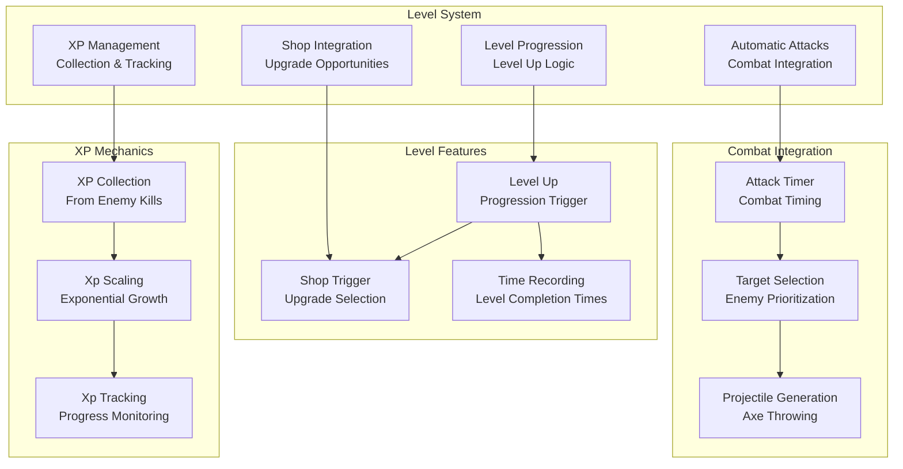
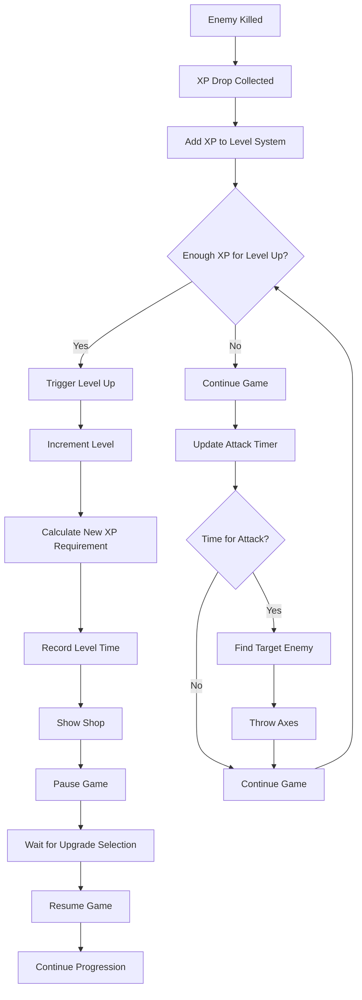

# Level System

## 🎯 Overview

BulletBuzz features a comprehensive level system that manages player progression, XP collection, automatic combat, and shop integration. The system provides engaging progression mechanics with exponential XP scaling, automatic attacks, and strategic upgrade opportunities.

## 🏗️ Architecture

### Core Components



### Level System Flow



## 🚀 Quick Start

### Basic Usage

```typescript
// Level system is automatically managed
game.update(1/60);

// Manual XP addition
game.levelSystem.addXp(10);

// Check level progress
const progress = game.levelSystem.getXpProgress();
console.log(`Level ${progress.level}: ${progress.current}/${progress.required} XP`);

// Check if target level reached
if (game.levelSystem.hasReachedLevel(5)) {
  console.log('Reached level 5!');
}
```

### Level Configuration

```typescript
// Level system parameters
const levelConfig = {
  baseXpRequirement: 10,     // Base XP for first level
  xpScalingFactor: 1.2,      // Exponential scaling multiplier
  attackSpeed: 1.0,          // Attacks per second
  attackRange: 150,          // Targeting distance
  projectileCount: 1,        // Axes per attack
  projectileSpeed: 200       // Axe movement speed
};
```

## 📈 XP Progression

### 1. XP Collection

XP is collected from enemy kills and processed by the level system:

```typescript
public addXp(amount: number): void {
  this.currentXp += amount;
}
```

### 2. XP Scaling

The XP requirement increases exponentially with each level:

```typescript
private levelUp(): void {
  this.game.level++;
  this.currentXp -= this.xpToNextLevel;
  
  // Calculate XP needed for next level
  this.xpToNextLevel = Math.floor(10 * Math.pow(1.2, this.game.level - 1));
}
```

**XP Progression Formula:**
- **Level 1**: 10 XP required
- **Level 2**: 12 XP required (10 × 1.2¹)
- **Level 3**: 14.4 XP required (10 × 1.2²)
- **Level 4**: 17.28 XP required (10 × 1.2³)
- **Level 5**: 20.74 XP required (10 × 1.2⁴)
- And so on...

### 3. XP Progress Tracking

The system tracks current XP progress:

```typescript
public getXpProgress(): { current: number; required: number; level: number } {
  return {
    current: this.currentXp,
    required: this.xpToNextLevel,
    level: this.game.level
  };
}
```

## 🎯 Level Progression

### 1. Level Up Process

When enough XP is collected, the level up process is triggered:

```typescript
private handleLevelProgression(): void {
  // Check if we have enough XP to level up
  if (this.currentXp >= this.xpToNextLevel) {
    this.levelUp();
  }
}

private levelUp(): void {
  this.game.level++;
  this.currentXp -= this.xpToNextLevel;
  
  // Calculate XP needed for next level
  this.xpToNextLevel = Math.floor(10 * Math.pow(1.2, this.game.level - 1));
  
  // Record level time
  const minutes = Math.floor(this.game.gameTime / 60);
  const seconds = Math.floor(this.game.gameTime % 60);
  this.game.levelTimes[this.game.level] = `${minutes}:${seconds.toString().padStart(2, '0')}`;
  
  // Show shop after every level and pause the game
  this.game.showShop = true;
  this.game.paused = true;
}
```

### 2. Level Time Recording

Each level completion time is recorded:

```typescript
// Record level time
const minutes = Math.floor(this.game.gameTime / 60);
const seconds = Math.floor(this.game.gameTime % 60);
this.game.levelTimes[this.game.level] = `${minutes}:${seconds.toString().padStart(2, '0')}`;
```

### 3. Shop Integration

After each level up, the shop appears for upgrade selection:

```typescript
// Show shop after every level and pause the game
this.game.showShop = true;
this.game.paused = true;
```

## ⚔️ Automatic Combat

### 1. Attack Timing

The level system manages automatic attacks based on attack speed:

```typescript
private handleAutomaticAttacks(): void {
  this.attackTimer += this.game.timestep;
  
  const attackInterval = 1.0 / this.game.attackSpeed;
  
  if (this.attackTimer >= attackInterval) {
    this.throwAxes();
    this.attackTimer = 0;
  }
}
```

### 2. Target Selection

The system intelligently selects targets for attacks:

```typescript
private throwAxes(): void {
  const player = this.game.player;
  
  // Find closest enemy within attack range
  let closestEnemy = null;
  let closestDistance = Infinity;
  
  for (const enemy of this.game.enemies) {
    const distance = Math.sqrt((player.x - enemy.x) ** 2 + (player.y - enemy.y) ** 2);
    if (distance < this.game.attackRange && distance < closestDistance) {
      closestDistance = distance;
      closestEnemy = enemy;
    }
  }
}
```

### 3. Projectile Generation

Axes are thrown at selected targets:

```typescript
if (closestEnemy) {
  // Throw multiple axes based on projectile count
  for (let i = 0; i < this.game.projectileCount; i++) {
    const axe = new Axe(
      player.x,
      player.y,
      closestEnemy.x,
      closestEnemy.y,
      this.game.projectileSpeed,
      1
    );
    this.game.axes.push(axe);
    this.game.axesThrown++;
  }
} else {
  // Throw random axes for visual feedback when no enemies are in range
  for (let i = 0; i < this.game.projectileCount; i++) {
    const randomAngle = Math.random() * Math.PI * 2;
    const randomDistance = 50 + Math.random() * 100;
    const targetX = player.x + Math.cos(randomAngle) * randomDistance;
    const targetY = player.y + Math.sin(randomAngle) * randomDistance;
    
    const axe = new Axe(
      player.x,
      player.y,
      targetX,
      targetY,
      this.game.projectileSpeed,
      1
    );
    this.game.axes.push(axe);
    this.game.axesThrown++;
  }
}
```

## 📊 Level Statistics

### Level Parameters

| Parameter | Default | Description | Impact |
|-----------|---------|-------------|--------|
| `baseXpRequirement` | 10 | Base XP for first level | Lower = faster early progression |
| `xpScalingFactor` | 1.2 | Exponential scaling multiplier | Higher = steeper progression curve |
| `attackSpeed` | 1.0 | Attacks per second | Higher = more frequent attacks |
| `attackRange` | 150 | Targeting distance | Higher = longer range attacks |
| `projectileCount` | 1 | Axes per attack | Higher = more damage output |

### Level Progression Table

| Level | XP Required | Cumulative XP | Time Estimate |
|-------|-------------|---------------|---------------|
| **1** | 10 | 10 | ~30 seconds |
| **2** | 12 | 22 | ~1 minute |
| **3** | 14.4 | 36.4 | ~1.5 minutes |
| **4** | 17.28 | 53.68 | ~2 minutes |
| **5** | 20.74 | 74.42 | ~2.5 minutes |
| **6** | 24.89 | 99.31 | ~3 minutes |
| **7** | 29.87 | 129.18 | ~4 minutes |
| **8** | 35.84 | 165.02 | ~5 minutes |
| **9** | 43.01 | 208.03 | ~6 minutes |
| **10** | 51.61 | 259.64 | ~8 minutes |

## 🎨 Visual Rendering

### XP Progress Bar

```typescript
// Draw XP progress bar
const progress = game.levelSystem.getXpProgress();
const progressPercent = progress.current / progress.required;

// Progress bar background
ctx.fillStyle = '#333';
ctx.fillRect(10, 10, 200, 20);

// Progress bar fill
ctx.fillStyle = '#FFD700';
ctx.fillRect(10, 10, 200 * progressPercent, 20);

// Progress text
ctx.fillStyle = 'white';
ctx.font = '14px serif';
ctx.fillText(`Level ${progress.level}: ${progress.current}/${progress.required} XP`, 15, 25);
```

### Level Time Display

```typescript
// Display level completion times
ctx.fillStyle = 'white';
ctx.font = '12px serif';
let yOffset = 50;

for (const [level, time] of Object.entries(game.levelTimes)) {
  ctx.fillText(`Level ${level}: ${time}`, 15, yOffset);
  yOffset += 15;
}
```

## ⚙️ Configuration Options

### Level System Parameters

| Parameter | Base Value | Increment | Max Value | Effect |
|-----------|------------|-----------|-----------|--------|
| **Base XP Requirement** | 10 | +2 | No limit | Early progression speed |
| **XP Scaling Factor** | 1.2 | +0.1 | 2.0 | Progression curve steepness |
| **Attack Speed** | 1.0 | +0.2 | No limit | Combat frequency |
| **Attack Range** | 150 | +5 | No limit | Combat effectiveness |
| **Projectile Count** | 1 | +1 | No limit | Damage output |

### System Integration

| System | Integration | Description |
|--------|-------------|-------------|
| **Combat System** | Automatic attacks | Handles projectile generation |
| **Shop System** | Level up triggers | Provides upgrade opportunities |
| **Pickup System** | XP collection | Processes XP from drops |
| **Player System** | Level progression | Affects player capabilities |

## 🧪 Testing

### Unit Tests

```typescript
// Test XP addition and level progression
test('XP addition increases progress', () => {
  const game = new Game();
  const initialProgress = game.levelSystem.getXpProgress();
  
  game.levelSystem.addXp(5);
  const newProgress = game.levelSystem.getXpProgress();
  
  expect(newProgress.current).toBe(initialProgress.current + 5);
});

// Test level up mechanics
test('level up occurs when XP requirement met', () => {
  const game = new Game();
  const initialLevel = game.level;
  
  // Add enough XP to level up
  game.levelSystem.addXp(10);
  game.update(1/60);
  
  expect(game.level).toBe(initialLevel + 1);
});

// Test XP scaling
test('XP requirement increases exponentially', () => {
  const game = new Game();
  
  // Level up to level 2
  game.levelSystem.addXp(10);
  game.update(1/60);
  
  const progress = game.levelSystem.getXpProgress();
  expect(progress.required).toBe(12); // 10 * 1.2¹
});

// Test attack timing
test('attacks occur at correct intervals', () => {
  const game = new Game();
  const initialAxeCount = game.axes.length;
  
  // Wait for one attack interval
  game.update(1.0 / game.attackSpeed);
  
  expect(game.axes.length).toBeGreaterThan(initialAxeCount);
});
```

### Integration Tests

```typescript
// Test complete level progression flow
test('enemy kill provides XP and triggers level up', () => {
  const game = new Game();
  const enemy = new Enemy(150, 150);
  game.enemies.push(enemy);
  
  // Kill enemy to spawn XP drop
  enemy.takeDamage(enemy.hp);
  game.collisionSystem.update();
  
  // Collect XP drop
  const xpDrop = game.xpDrops[0];
  if (xpDrop) {
    xpDrop.x = game.player.x;
    xpDrop.y = game.player.y;
    game.collisionSystem.update();
  }
  
  // Check if level up occurred
  expect(game.level).toBeGreaterThan(1);
});

// Test shop integration
test('shop appears after level up', () => {
  const game = new Game();
  
  // Trigger level up
  game.levelSystem.addXp(10);
  game.update(1/60);
  
  expect(game.showShop).toBe(true);
  expect(game.paused).toBe(true);
});
```

### Performance Tests

```typescript
// Test level system performance
test('level system performance with many enemies', () => {
  const game = new Game();
  
  // Create many enemies
  for (let i = 0; i < 50; i++) {
    const enemy = new Enemy(Math.random() * 800, Math.random() * 600);
    game.enemies.push(enemy);
  }
  
  const startTime = performance.now();
  
  // Update level system
  game.update(1/60);
  
  const endTime = performance.now();
  
  // Should complete within reasonable time
  expect(endTime - startTime).toBeLessThan(1); // 1ms
});
```

## 🐛 Troubleshooting

### Common Issues

#### **Level Up Not Triggering**
```typescript
// Check XP progress
console.log('Level up check:', {
  currentXp: this.currentXp,
  xpToNextLevel: this.xpToNextLevel,
  level: this.game.level,
  shouldLevelUp: this.currentXp >= this.xpToNextLevel
});
```

#### **Attacks Not Firing**
```typescript
// Check attack timing
console.log('Attack timing:', {
  attackTimer: this.attackTimer,
  attackInterval: 1.0 / this.game.attackSpeed,
  shouldAttack: this.attackTimer >= (1.0 / this.game.attackSpeed)
});
```

#### **XP Not Being Added**
```typescript
// Check XP addition
console.log('XP addition:', {
  amount: amount,
  currentXp: this.currentXp,
  xpToNextLevel: this.xpToNextLevel
});
```

### Debug Mode

```typescript
// Enable level system debug mode
const DEBUG_LEVEL_SYSTEM = true;

if (DEBUG_LEVEL_SYSTEM) {
  console.log('Level System Debug:', {
    currentXp: this.currentXp,
    xpToNextLevel: this.xpToNextLevel,
    level: this.game.level,
    attackTimer: this.attackTimer,
    attackSpeed: this.game.attackSpeed,
    enemiesCount: this.game.enemies.length
  });
}
```

## 🎯 Performance Optimization

### Optimization Strategies

1. **Efficient XP Calculation**
   ```typescript
   // Cache XP requirement calculation
   private calculateXpRequirement(level: number): number {
     return Math.floor(10 * Math.pow(1.2, level - 1));
   }
   ```

2. **Optimized Attack Timing**
   ```typescript
   // Use fixed timestep for consistent attack timing
   private handleAutomaticAttacks(): void {
     this.attackTimer += this.game.timestep;
     
     const attackInterval = 1.0 / this.game.attackSpeed;
     
     if (this.attackTimer >= attackInterval) {
       this.throwAxes();
       this.attackTimer = 0;
     }
   }
   ```

3. **Efficient Target Selection**
   ```typescript
   // Only check enemies within reasonable distance
   const nearbyEnemies = this.game.enemies.filter(enemy => {
     const distance = Math.sqrt((player.x - enemy.x) ** 2 + (player.y - enemy.y) ** 2);
     return distance < this.game.attackRange * 1.5; // Check slightly beyond attack range
   });
   ```

### Performance Metrics

- **Level System Update**: < 0.01ms per frame
- **XP Calculation**: < 0.001ms per calculation
- **Attack Generation**: < 0.005ms per attack
- **Memory Usage**: Minimal object allocation

## 🔮 Future Enhancements

### Planned Features

- [ ] **Level Cap System** - Maximum level limits
- [ ] **Prestige System** - Reset with bonuses
- [ ] **Level Bonuses** - Special rewards at milestone levels
- [ ] **Dynamic Scaling** - Adaptive XP requirements
- [ ] **Level Events** - Special challenges at certain levels

### Technical Debt

- [ ] **TypeScript Types** - Better type definitions for level entities
- [ ] **Unit Tests** - Comprehensive test coverage for level mechanics
- [ ] **Performance Monitoring** - Real-time level system metrics
- [ ] **Configuration System** - Runtime level parameter adjustment

## 📚 Related Documentation

- [**Shop System**](shop-system.md) - Upgrade selection after level up
- [**Combat System**](combat-system.md) - Automatic attack mechanics
- [**Pickup System**](pickup-system.md) - XP collection from drops
- [**Player System**](../core/Player.ts) - Player progression and stats
- [**Event System**](event-system.md) - Level up event handling

## 🎯 Best Practices

### Level Design Principles

1. **Balanced Progression** - Appropriate XP scaling for engagement
2. **Clear Milestones** - Obvious level up indicators
3. **Rewarding Experience** - Meaningful upgrades at each level
4. **Performance Conscious** - Efficient level system updates
5. **Accessible Gameplay** - Easy to understand progression mechanics

### Configuration Guidelines

1. **Start Conservative** - Begin with lower XP requirements
2. **Test Balance** - Ensure progression feels rewarding
3. **Monitor Performance** - Track level system efficiency
4. **Iterate Design** - Refine based on player feedback
5. **Document Changes** - Keep track of level adjustments

---

*Last updated: 2025-07-31*
*Level System Version: 1.0* 