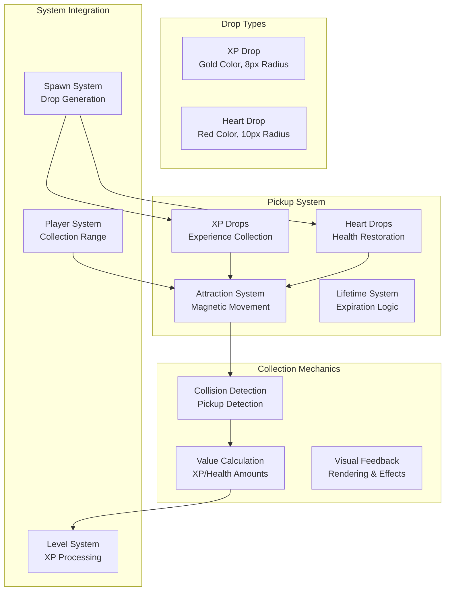
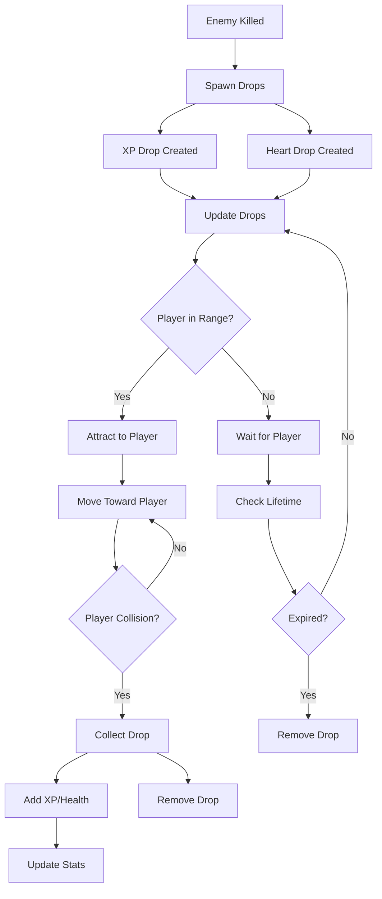

# Pickup System

## 🎯 Overview

BulletBuzz features a sophisticated pickup system that manages XP drops and heart drops with intelligent attraction mechanics. The system provides engaging collection gameplay with visual feedback, lifetime management, and automatic attraction to the player.

## 🏗️ Architecture

### Core Components



### Pickup Flow



## 🚀 Quick Start

### Basic Usage

```typescript
// Create XP drop
const xpDrop = new XpDrop(100, 100, 10); // x, y, value
game.xpDrops.push(xpDrop);

// Create heart drop
const heartDrop = new HeartDrop(150, 150, 2); // x, y, healAmount
game.heartDrops.push(heartDrop);

// Update drops with attraction
xpDrop.update(deltaTime, player.x, player.y, player.pickupRange);
heartDrop.update(deltaTime, player.x, player.y, player.pickupRange);

// Collect drops
const xpValue = xpDrop.collect();
const healAmount = heartDrop.collect();
```

### Pickup Configuration

```typescript
// Pickup system parameters
const pickupConfig = {
  xpDropRadius: 8,           // XP drop visual radius
  heartDropRadius: 10,        // Heart drop visual radius
  attractionSpeed: 2.0,       // Speed drops move toward player
  xpDropLifetime: 10.0,      // XP drop lifetime in seconds
  heartDropLifetime: 15.0,    // Heart drop lifetime in seconds
  pickupRange: 25,           // Player pickup range
  xpValue: 10,               // XP per drop
  healAmount: 2              // Health per heart
};
```

## 🎁 Pickup Types

### 1. XP Drops

XP drops provide experience points for level progression:

```typescript
export class XpDrop implements XpDropType {
  public x: number;
  public y: number;
  public radius: number;
  public value: number;
  public color: string;
  public lifetime: number;
  public collected: boolean;

  constructor(x: number, y: number, value: number = 1) {
    this.x = x;
    this.y = y;
    this.radius = 8;
    this.value = value;
    this.color = '#FFD700'; // Gold color
    this.lifetime = 10.0; // 10 seconds
    this.collected = false;
  }
}
```

**XP Drop Properties:**
- **Radius**: 8 pixels - Visual size
- **Color**: Gold (#FFD700) - Distinctive appearance
- **Lifetime**: 10 seconds - Time before expiration
- **Value**: Configurable XP amount
- **Attraction**: Moves toward player when in range

### 2. Heart Drops

Heart drops restore player health:

```typescript
export class HeartDrop implements HeartDropType {
  public x: number;
  public y: number;
  public radius: number;
  public healAmount: number;
  public color: string;
  public lifetime: number;
  public collected: boolean;

  constructor(x: number, y: number, healAmount: number = 2) {
    this.x = x;
    this.y = y;
    this.radius = 10;
    this.healAmount = healAmount;
    this.color = '#FF6B6B'; // Red color
    this.lifetime = 15.0; // 15 seconds
    this.collected = false;
  }
}
```

**Heart Drop Properties:**
- **Radius**: 10 pixels - Slightly larger than XP drops
- **Color**: Red (#FF6B6B) - Health indicator
- **Lifetime**: 15 seconds - Longer than XP drops
- **Heal Amount**: Configurable health restoration
- **Attraction**: Moves toward player when in range

## 🧲 Attraction System

### Magnetic Movement

Both XP and heart drops are attracted to the player when within pickup range:

```typescript
public update(deltaTime: number, playerX?: number, playerY?: number, pickupRange?: number): void {
  this.lifetime -= deltaTime;
  
  // Attract to player if in pickup range
  if (playerX !== undefined && playerY !== undefined && pickupRange !== undefined) {
    const distance = Math.sqrt((this.x - playerX) ** 2 + (this.y - playerY) ** 2);
    
    if (distance < pickupRange) {
      // Calculate attraction force
      const attractionSpeed = 2.0; // Speed at which drops move toward player
      const dx = playerX - this.x;
      const dy = playerY - this.y;
      const distanceToPlayer = Math.sqrt(dx * dx + dy * dy);
      
      if (distanceToPlayer > 0) {
        // Normalize and apply attraction
        const normalizedDx = dx / distanceToPlayer;
        const normalizedDy = dy / distanceToPlayer;
        
        this.x += normalizedDx * attractionSpeed * deltaTime;
        this.y += normalizedDy * attractionSpeed * deltaTime;
      }
    }
  }
}
```

### Attraction Parameters

| Parameter | Value | Description | Impact |
|-----------|-------|-------------|--------|
| `attractionSpeed` | 2.0 | Speed drops move toward player | Higher = faster attraction |
| `pickupRange` | 25 | Distance to start attraction | Higher = larger attraction zone |
| `deltaTime` | Variable | Time since last update | Affects movement smoothness |

## 🎯 Collection Mechanics

### Collision Detection

Drops are collected when the player collides with them:

```typescript
private checkPlayerPickupCollisions(): void {
  const player = this.game.player;
  
  // Check XP drops
  for (let i = this.game.xpDrops.length - 1; i >= 0; i--) {
    const xp = this.game.xpDrops[i];
    const distance = Math.sqrt((player.x - xp.x) ** 2 + (player.y - xp.y) ** 2);
    
    // Only collect when actually colliding with player (not just in pickup range)
    if (distance < xp.radius) {
      const value = xp.collect();
      if (value > 0) {
        this.game.xpCollected += value;
        this.game.levelSystem.addXp(value); // Add XP to level system
        this.game.xpDrops.splice(i, 1);
      }
    }
  }
  
  // Check heart drops
  for (let i = this.game.heartDrops.length - 1; i >= 0; i--) {
    const heart = this.game.heartDrops[i];
    const distance = Math.sqrt((player.x - heart.x) ** 2 + (player.y - heart.y) ** 2);
    
    // Only collect when actually colliding with player (not just in pickup range)
    if (distance < heart.radius) {
      const healAmount = heart.collect();
      if (healAmount > 0) {
        player.heal(healAmount);
        this.game.heartsCollected++;
        this.game.heartDrops.splice(i, 1);
      }
    }
  }
}
```

### Collection Logic

```typescript
// XP Drop Collection
public collect(): number {
  if (!this.collected) {
    this.collected = true;
    return this.value;
  }
  return 0;
}

// Heart Drop Collection
public collect(): number {
  if (!this.collected) {
    this.collected = true;
    return this.healAmount;
  }
  return 0;
}
```

## ⏰ Lifetime Management

### Expiration System

Drops automatically expire after their lifetime:

```typescript
public update(deltaTime: number, playerX?: number, playerY?: number, pickupRange?: number): void {
  this.lifetime -= deltaTime;
  // ... attraction logic
}

public isExpired(): boolean {
  return this.lifetime <= 0;
}
```

### Lifetime Parameters

| Drop Type | Lifetime | Description | Impact |
|-----------|----------|-------------|--------|
| **XP Drops** | 10 seconds | Time before XP drops expire | Shorter = more urgency |
| **Heart Drops** | 15 seconds | Time before heart drops expire | Longer = more time to collect |

## 🎨 Visual Rendering

### Drop Rendering

```typescript
// Draw XP drops
for (const xp of this.game.xpDrops) {
  ctx.fillStyle = xp.color;
  ctx.beginPath();
  ctx.arc(xp.x, xp.y, xp.radius, 0, 2 * Math.PI);
  ctx.fill();
  
  // Optional: Add glow effect
  ctx.shadowColor = xp.color;
  ctx.shadowBlur = 10;
  ctx.fill();
  ctx.shadowBlur = 0;
}

// Draw heart drops
for (const heart of this.game.heartDrops) {
  ctx.fillStyle = heart.color;
  ctx.beginPath();
  ctx.arc(heart.x, heart.y, heart.radius, 0, 2 * Math.PI);
  ctx.fill();
  
  // Optional: Add pulse effect
  const pulseScale = 1 + 0.1 * Math.sin(Date.now() * 0.01);
  ctx.save();
  ctx.translate(heart.x, heart.y);
  ctx.scale(pulseScale, pulseScale);
  ctx.fill();
  ctx.restore();
}
```

### Pickup Range Indicator

```typescript
// Draw pickup range indicator
ctx.strokeStyle = 'rgba(255, 255, 255, 0.2)';
ctx.lineWidth = 1;
ctx.beginPath();
ctx.arc(player.x, player.y, player.pickupRange, 0, 2 * Math.PI);
ctx.stroke();
```

## 📊 Pickup Statistics

### Collection Tracking

```typescript
// Pickup statistics
this.game.xpCollected += value;     // Total XP collected
this.game.heartsCollected++;        // Total hearts collected
this.game.levelSystem.addXp(value); // Add XP to level system
player.heal(healAmount);           // Restore player health
```

### Performance Metrics

| Metric | Target | Description |
|--------|--------|-------------|
| **Drop Updates** | < 0.01ms per drop | Update time for each drop |
| **Collision Checks** | < 0.005ms per check | Collision detection time |
| **Memory Usage** | Minimal | Object allocation per drop |
| **Visual Rendering** | < 0.02ms per drop | Rendering time per drop |

## ⚙️ Configuration Options

### Pickup Parameters

| Parameter | XP Drops | Heart Drops | Description |
|-----------|----------|-------------|-------------|
| **Radius** | 8px | 10px | Visual size |
| **Lifetime** | 10s | 15s | Time before expiration |
| **Attraction Speed** | 2.0 | 2.0 | Movement speed toward player |
| **Base Value** | 10 XP | 2 HP | Collection value |
| **Color** | Gold | Red | Visual appearance |

### System Integration

| System | Integration | Description |
|--------|-------------|-------------|
| **Spawn System** | Drop generation | Creates drops at enemy death |
| **Player System** | Collection range | Determines attraction distance |
| **Level System** | XP processing | Handles XP collection |
| **Collision System** | Collection detection | Manages pickup collisions |

## 🧪 Testing

### Unit Tests

```typescript
// Test XP drop creation and collection
test('XP drop provides correct value', () => {
  const xpDrop = new XpDrop(100, 100, 15);
  
  const value = xpDrop.collect();
  
  expect(value).toBe(15);
  expect(xpDrop.collected).toBe(true);
});

// Test heart drop healing
test('heart drop heals player', () => {
  const heartDrop = new HeartDrop(100, 100, 3);
  const player = new Player();
  const initialHp = player.hp;
  
  const healAmount = heartDrop.collect();
  player.heal(healAmount);
  
  expect(player.hp).toBe(initialHp + 3);
});

// Test attraction mechanics
test('drops move toward player', () => {
  const xpDrop = new XpDrop(100, 100, 10);
  const initialX = xpDrop.x;
  const initialY = xpDrop.y;
  
  // Update with player nearby
  xpDrop.update(0.1, 150, 150, 100);
  
  expect(xpDrop.x).toBeGreaterThan(initialX);
  expect(xpDrop.y).toBeGreaterThan(initialY);
});

// Test lifetime expiration
test('drops expire after lifetime', () => {
  const xpDrop = new XpDrop(100, 100, 10);
  
  // Simulate lifetime expiration
  xpDrop.update(11.0); // Lifetime is 10 seconds
  
  expect(xpDrop.isExpired()).toBe(true);
});
```

### Integration Tests

```typescript
// Test complete pickup flow
test('enemy death spawns drops', () => {
  const game = new Game();
  const enemy = new Enemy(150, 150);
  game.enemies.push(enemy);
  
  // Kill enemy
  enemy.takeDamage(enemy.hp);
  game.collisionSystem.update();
  
  expect(game.xpDrops.length).toBeGreaterThan(0);
  expect(game.heartDrops.length).toBeGreaterThan(0);
});

// Test collection statistics
test('collection stats are tracked', () => {
  const game = new Game();
  const initialStats = {
    xpCollected: game.xpCollected,
    heartsCollected: game.heartsCollected
  };
  
  // Create and collect drops
  const xpDrop = new XpDrop(100, 100, 10);
  const heartDrop = new HeartDrop(100, 100, 2);
  
  game.xpDrops.push(xpDrop);
  game.heartDrops.push(heartDrop);
  
  // Simulate collection
  game.collisionSystem.update();
  
  expect(game.xpCollected).toBeGreaterThan(initialStats.xpCollected);
  expect(game.heartsCollected).toBeGreaterThan(initialStats.heartsCollected);
});
```

### Performance Tests

```typescript
// Test pickup system performance with many drops
test('pickup system performance with 100 drops', () => {
  const game = new Game();
  
  // Create 100 drops
  for (let i = 0; i < 100; i++) {
    const xpDrop = new XpDrop(Math.random() * 800, Math.random() * 600, 10);
    const heartDrop = new HeartDrop(Math.random() * 800, Math.random() * 600, 2);
    game.xpDrops.push(xpDrop);
    game.heartDrops.push(heartDrop);
  }
  
  const startTime = performance.now();
  
  // Update all drops
  for (const xp of game.xpDrops) {
    xp.update(1/60, game.player.x, game.player.y, game.player.pickupRange);
  }
  for (const heart of game.heartDrops) {
    heart.update(1/60, game.player.x, game.player.y, game.player.pickupRange);
  }
  
  const endTime = performance.now();
  
  // Should complete within reasonable time
  expect(endTime - startTime).toBeLessThan(1); // 1ms
});
```

## 🐛 Troubleshooting

### Common Issues

#### **Drops Not Moving Toward Player**
```typescript
// Check attraction parameters
console.log('Attraction check:', {
  playerPosition: { x: playerX, y: playerY },
  dropPosition: { x: this.x, y: this.y },
  distance: Math.sqrt((this.x - playerX) ** 2 + (this.y - playerY) ** 2),
  pickupRange: pickupRange,
  attractionSpeed: 2.0
});
```

#### **Drops Not Being Collected**
```typescript
// Check collision detection
console.log('Collection check:', {
  playerPosition: { x: player.x, y: player.y },
  dropPosition: { x: drop.x, y: drop.y },
  distance: Math.sqrt((player.x - drop.x) ** 2 + (player.y - drop.y) ** 2),
  dropRadius: drop.radius,
  collected: drop.collected
});
```

#### **Drops Expiring Too Quickly**
```typescript
// Check lifetime management
console.log('Lifetime check:', {
  lifetime: this.lifetime,
  deltaTime: deltaTime,
  isExpired: this.isExpired()
});
```

### Debug Mode

```typescript
// Enable pickup debug mode
const DEBUG_PICKUPS = true;

if (DEBUG_PICKUPS) {
  console.log('Pickup Debug:', {
    xpDropsCount: this.game.xpDrops.length,
    heartDropsCount: this.game.heartDrops.length,
    xpCollected: this.game.xpCollected,
    heartsCollected: this.game.heartsCollected,
    playerPickupRange: this.game.player.pickupRange
  });
}
```

## 🎯 Performance Optimization

### Optimization Strategies

1. **Spatial Partitioning**
   ```typescript
   // Only update drops near the player
   const nearbyDrops = drops.filter(drop => {
     const distance = Math.sqrt((drop.x - player.x) ** 2 + (drop.y - player.y) ** 2);
     return distance < 200; // Only update drops within 200 pixels
   });
   ```

2. **Object Pooling**
   ```typescript
   // Reuse drop objects instead of creating new ones
   class DropPool {
     private xpPool: XpDrop[] = [];
     private heartPool: HeartDrop[] = [];
     
     getXpDrop(): XpDrop {
       return this.xpPool.pop() || new XpDrop(0, 0, 0);
     }
     
     returnXpDrop(drop: XpDrop): void {
       this.xpPool.push(drop);
     }
   }
   ```

3. **Efficient Collision Detection**
   ```typescript
   // Use squared distance to avoid square root
   const dx = player.x - drop.x;
   const dy = player.y - drop.y;
   const distanceSquared = dx * dx + dy * dy;
   const collisionDistanceSquared = drop.radius * drop.radius;
   
   if (distanceSquared < collisionDistanceSquared) {
     // Collision detected
   }
   ```

### Performance Metrics

- **Drop Update Time**: < 0.01ms per drop
- **Collision Detection**: < 0.005ms per check
- **Visual Rendering**: < 0.02ms per drop
- **Memory Usage**: Minimal object allocation

## 🔮 Future Enhancements

### Planned Features

- [ ] **Rarity System** - Common, rare, epic drops
- [ ] **Combo System** - Collection bonuses
- [ ] **Special Drops** - Temporary power-ups
- [ ] **Drop Effects** - Visual and audio effects
- [ ] **Drop Categories** - Different drop types

### Technical Debt

- [ ] **TypeScript Types** - Better type definitions for drop entities
- [ ] **Unit Tests** - Comprehensive test coverage for pickup mechanics
- [ ] **Performance Monitoring** - Real-time pickup performance metrics
- [ ] **Configuration System** - Runtime pickup parameter adjustment

## 📚 Related Documentation

- [**Combat System**](combat-system.md) - Drop generation from enemy kills
- [**Level System**](level-system.md) - XP processing and level progression
- [**Player System**](../core/Player.ts) - Health restoration and pickup range
- [**Spawn System**](spawn-system.md) - Drop generation mechanics
- [**Event System**](event-system.md) - Pickup event handling

## 🎯 Best Practices

### Pickup Design Principles

1. **Clear Visual Feedback** - Obvious drop appearance and behavior
2. **Balanced Collection** - Appropriate drop rates and values
3. **Smooth Attraction** - Natural movement toward player
4. **Performance Conscious** - Efficient update and rendering
5. **Accessible Gameplay** - Easy to understand collection mechanics

### Configuration Guidelines

1. **Start Conservative** - Begin with lower drop rates
2. **Test Balance** - Ensure drops provide meaningful progression
3. **Monitor Performance** - Track frame rate with many drops
4. **Iterate Design** - Refine based on player feedback
5. **Document Changes** - Keep track of pickup adjustments

---

*Last updated: 2025-07-31*
*Pickup Version: 1.0* 