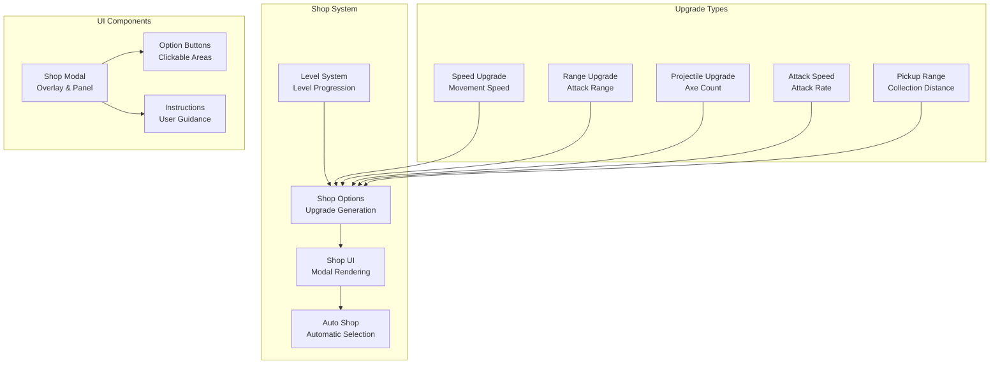
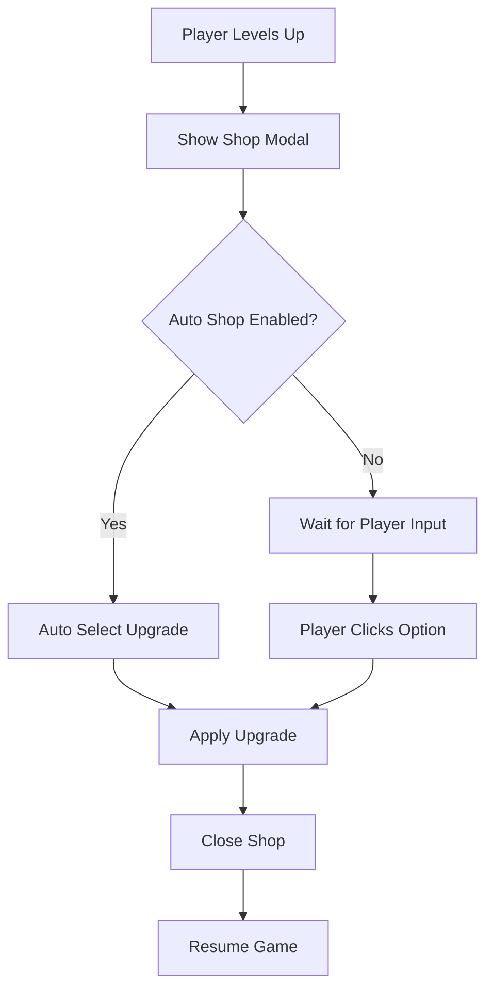

# Shop System

## 🎯 Overview

BulletBuzz features a comprehensive shop system that appears after each level up, allowing players to choose upgrades that enhance their character's abilities. The shop system includes manual selection, auto-shop functionality, and a variety of upgrade options that affect gameplay mechanics.

## 🏗️ Architecture

### Core Components



### Shop Flow



## 🚀 Quick Start

### Basic Usage

```typescript
// Shop appears automatically after level up
if (this.currentXp >= this.xpToNextLevel) {
  this.levelUp(); // This triggers shop
}

// Manual shop selection
game.selectShopOption('1'); // Select first option

// Auto-shop functionality
game.autoShop(); // Automatically select best option
```

### Shop Configuration

```typescript
// Available upgrade options
const shopOptions = [
  { key: '1', label: '⚡ +0.1 Speed', apply: () => game.player.speed += 0.1 },
  { key: '2', label: '🎯 +5 Attack Range', apply: () => game.attackRange += 5 },
  { key: '3', label: '🪓 +1 Projectile', apply: () => game.projectileCount++ },
  { key: '4', label: '💨 +0.2 Attack Speed', apply: () => game.attackSpeed += 0.2 },
  { key: '5', label: '📏 +2 Pickup Range', apply: () => game.player.pickupRange += 2 }
];
```

## 🏪 Shop Mechanics

### 1. Level Progression

The shop appears automatically when the player levels up:

```typescript
private levelUp(): void {
  this.game.level++;
  this.currentXp -= this.xpToNextLevel;
  
  // Calculate XP needed for next level
  this.xpToNextLevel = Math.floor(10 * Math.pow(1.2, this.game.level - 1));
  
  // Record level time
  const minutes = Math.floor(this.game.gameTime / 60);
  const seconds = Math.floor(this.game.gameTime % 60);
  this.game.levelTimes[this.game.level] = `${minutes}:${seconds.toString().padStart(2, '0')}`;
  
  // Show shop after every level and pause the game
  this.game.showShop = true;
  this.game.paused = true;
}
```

**XP Progression:**
- **Level 1**: 10 XP required
- **Level 2**: 12 XP required (1.2x multiplier)
- **Level 3**: 14.4 XP required
- **Level 4**: 17.28 XP required
- And so on...

### 2. Upgrade Options

The shop offers 5 different upgrade types:

#### **Speed Upgrade** ⚡
```typescript
{ key: '1', label: '⚡ +0.1 Speed', apply: () => this.game.player.speed += 0.1 }
```
- **Effect**: Increases player movement speed by 0.1
- **Impact**: Better positioning and escape ability
- **Base Speed**: 0.85 (configurable)

#### **Attack Range Upgrade** 🎯
```typescript
{ key: '2', label: '🎯 +5 Attack Range', apply: () => this.game.attackRange += 5 }
```
- **Effect**: Increases attack range by 5 pixels
- **Impact**: Can attack enemies from further away
- **Base Range**: 150 pixels (configurable)

#### **Projectile Count Upgrade** 🪓
```typescript
{ key: '3', label: '🪓 +1 Projectile', apply: () => this.game.projectileCount++ }
```
- **Effect**: Throws one additional axe per attack
- **Impact**: Higher damage output and area coverage
- **Base Count**: 1 projectile (configurable)

#### **Attack Speed Upgrade** 💨
```typescript
{ key: '4', label: '💨 +0.2 Attack Speed', apply: () => this.game.attackSpeed += 0.2 }
```
- **Effect**: Increases attack rate by 0.2 attacks per second
- **Impact**: More frequent attacks
- **Base Speed**: 1.0 attacks per second (configurable)

#### **Pickup Range Upgrade** 📏
```typescript
{ key: '5', label: '📏 +2 Pickup Range', apply: () => this.game.player.pickupRange += 2 }
```
- **Effect**: Increases pickup range by 2 pixels
- **Impact**: Easier collection of XP and hearts
- **Base Range**: 25 pixels (configurable)

### 3. Option Generation

The shop randomly selects 3 options from the available 5:

```typescript
public getShopOptions(): ShopOption[] {
  if (this.game.showShop && this.shopOptions.length === 0) {
    const allOptions = [
      { key: '1', label: '⚡ +0.1 Speed', apply: () => this.game.player.speed += 0.1 },
      { key: '2', label: '🎯 +5 Attack Range', apply: () => this.game.attackRange += 5 },
      { key: '3', label: '🪓 +1 Projectile', apply: () => this.game.projectileCount++ },
      { key: '4', label: '💨 +0.2 Attack Speed', apply: () => this.game.attackSpeed += 0.2 },
      { key: '5', label: '📏 +2 Pickup Range', apply: () => this.game.player.pickupRange += 2 }
    ];
    
    // Shuffle and take 3 random options, then renumber them sequentially
    this.shopOptions = allOptions
      .sort(() => 0.5 - Math.random())
      .slice(0, 3)
      .map((option, index) => ({
        ...option,
        key: (index + 1).toString()
      }));
  }
  
  return this.shopOptions;
}
```

## 🎨 Shop UI

### Modal Design

The shop appears as a modal overlay with a professional design:

```typescript
function drawShop(): void {
  if (!game || !ctx || !canvas) return;
  
  const shopOptions = game.getShopOptions();
  
  // Semi-transparent overlay
  ctx.fillStyle = 'rgba(0, 0, 0, 0.7)';
  ctx.fillRect(0, 0, canvas.width, canvas.height);
  
  // Shop panel
  const panelWidth = 450;
  const panelHeight = 280;
  const panelX = (canvas.width - panelWidth) / 2;
  const panelY = (canvas.height - panelHeight) / 2;
  
  // Panel background with gradient effect
  ctx.fillStyle = '#2a2a2a';
  ctx.fillRect(panelX, panelY, panelWidth, panelHeight);
  ctx.strokeStyle = '#666';
  ctx.lineWidth = 2;
  ctx.strokeRect(panelX, panelY, panelWidth, panelHeight);
}
```

### Button Styling

Each option is rendered as a clickable button:

```typescript
// Options with button-like styling
ctx.font = '18px serif';
shopOptions.forEach((option, index) => {
  const optionY = panelY + 110 + index * 45;
  const key = option.key;
  const label = option.label;
  
  // Button background with hover effect
  ctx!.fillStyle = '#444';
  ctx!.fillRect(panelX + 25, optionY - 20, panelWidth - 50, 35);
  
  // Button border
  ctx!.strokeStyle = '#666';
  ctx!.lineWidth = 1;
  ctx!.strokeRect(panelX + 25, optionY - 20, panelWidth - 50, 35);
  
  // Option text with better spacing and vertical centering
  ctx!.fillStyle = 'white';
  ctx!.textAlign = 'left';
  ctx!.textBaseline = 'middle';
  ctx!.fillText(`${key}. ${label}`, panelX + 40, optionY - 2.5);
});
```

### Click Handling

The shop supports both mouse clicks and keyboard input:

```typescript
function handleShopClick(x: number, y: number): void {
  if (!game || !game.isShopOpen()) return;
  
  const shopOptions = game.getShopOptions();
  
  // Calculate shop panel bounds
  const panelWidth = 450;
  const panelHeight = 280;
  const panelX = (canvas.width - panelWidth) / 2;
  const panelY = (canvas.height - panelHeight) / 2;
  
  // Check if click is within panel
  if (x >= panelX && x <= panelX + panelWidth &&
      y >= panelY && y <= panelY + panelHeight) {
    
    // Check each option button
    shopOptions.forEach((option, index) => {
      const optionY = panelY + 110 + index * 45;
      const buttonX = panelX + 25;
      const buttonY = optionY - 20;
      const buttonWidth = panelWidth - 50;
      const buttonHeight = 35;
      
      if (x >= buttonX && x <= buttonX + buttonWidth &&
          y >= buttonY && y <= buttonY + buttonHeight) {
        game.selectShopOption(option.key);
      }
    });
  }
}
```

## 🤖 Auto-Shop System

### Automatic Selection

The auto-shop feature automatically selects upgrades based on priority:

```typescript
public autoShop(): void {
  if (this.shopOptions.length === 0) return;
  
  // Priority system for auto-selection
  const priorities = ['3', '4', '2', '1', '5']; // Projectile > Attack Speed > Range > Speed > Pickup
  
  for (const priority of priorities) {
    const option = this.shopOptions.find(opt => opt.key === priority);
    if (option) {
      this.selectShopOption(priority);
      return;
    }
  }
  
  // Fallback to first option
  this.selectShopOption(this.shopOptions[0].key);
}
```

### Priority System

The auto-shop uses a priority-based selection system:

1. **🪓 Projectile Count** (Priority 1) - Most important for damage output
2. **💨 Attack Speed** (Priority 2) - Increases attack frequency
3. **🎯 Attack Range** (Priority 3) - Better positioning
4. **⚡ Speed** (Priority 4) - Movement and positioning
5. **📏 Pickup Range** (Priority 5) - Quality of life improvement

### Auto-Shop Configuration

```typescript
// Enable auto-shop via checkbox
const autoShopCheckbox = document.getElementById("autoShop") as HTMLInputElement;
if (autoShopCheckbox && autoShopCheckbox.checked) {
  // Use setTimeout to allow the shop to render first
  setTimeout(() => {
    this.autoShop();
  }, 100);
}
```

## ⚙️ Configuration Options

### Shop Parameters

| Parameter | Default | Description | Impact |
|-----------|---------|-------------|--------|
| `shopOptionsCount` | 3 | Number of options shown | More choice vs. faster decisions |
| `autoShopDelay` | 100ms | Delay before auto-selection | Allows UI to render |
| `levelUpPause` | true | Pause game during shop | Prevents gameplay during selection |
| `upgradeEffects` | 5 types | Available upgrade types | Gameplay variety |

### Upgrade Effects

| Upgrade Type | Base Value | Increment | Max Value | Impact |
|-------------|------------|-----------|-----------|--------|
| **Speed** | 0.85 | +0.1 | No limit | Movement and positioning |
| **Attack Range** | 150 | +5 | No limit | Combat effectiveness |
| **Projectile Count** | 1 | +1 | No limit | Damage output |
| **Attack Speed** | 1.0 | +0.2 | No limit | Attack frequency |
| **Pickup Range** | 25 | +2 | No limit | Collection efficiency |

## 🧪 Testing

### Unit Tests

```typescript
// Test shop option generation
test('shop generates 3 random options', () => {
  const game = new BulletBuzzGame();
  game.levelUp(); // Trigger shop
  
  const options = game.getShopOptions();
  expect(options).toHaveLength(3);
  expect(options[0].key).toBe('1');
  expect(options[1].key).toBe('2');
  expect(options[2].key).toBe('3');
});

// Test upgrade application
test('speed upgrade increases player speed', () => {
  const game = new BulletBuzzGame();
  const initialSpeed = game.player.speed;
  
  game.selectShopOption('1'); // Speed upgrade
  
  expect(game.player.speed).toBe(initialSpeed + 0.1);
});

// Test auto-shop functionality
test('auto-shop selects priority option', () => {
  const game = new BulletBuzzGame();
  game.levelUp();
  
  game.autoShop();
  
  // Should select projectile upgrade (priority 1)
  expect(game.projectileCount).toBe(2); // Base 1 + 1 upgrade
});
```

### Integration Tests

```typescript
// Test complete shop flow
test('shop appears after level up', () => {
  const game = new BulletBuzzGame();
  
  // Add enough XP to level up
  game.levelSystem.addXp(10);
  game.update(1/60);
  
  expect(game.isShopOpen()).toBe(true);
  expect(game.getPaused()).toBe(true);
});

// Test shop closes after selection
test('shop closes after option selection', () => {
  const game = new BulletBuzzGame();
  game.levelUp();
  
  game.selectShopOption('1');
  
  expect(game.isShopOpen()).toBe(false);
  expect(game.getPaused()).toBe(false);
});
```

### UI Tests

```typescript
// Test shop modal rendering
test('shop modal renders correctly', async () => {
  const page = await browser.newPage();
  await page.goto('http://localhost:8080');
  
  // Trigger level up
  await page.evaluate(() => {
    const game = window.game;
    game.levelSystem.addXp(10);
    game.update(1/60);
  });
  
  // Check if shop modal is visible
  const shopModal = await page.locator('canvas');
  await expect(shopModal).toBeVisible();
  
  // Check for shop title
  const shopTitle = await page.locator('text=SHOP');
  await expect(shopTitle).toBeVisible();
});
```

## 🐛 Troubleshooting

### Common Issues

#### **Shop Doesn't Appear**
```typescript
// Check if level up conditions are met
console.log('Level up check:', {
  currentXp: this.currentXp,
  xpToNextLevel: this.xpToNextLevel,
  level: this.game.level
});
```

#### **Auto-Shop Not Working**
```typescript
// Check auto-shop checkbox state
const autoShopCheckbox = document.getElementById("autoShop") as HTMLInputElement;
console.log('Auto-shop state:', {
  checked: autoShopCheckbox?.checked,
  exists: !!autoShopCheckbox
});
```

#### **Upgrade Not Applied**
```typescript
// Check upgrade application
console.log('Upgrade application:', {
  optionKey: key,
  shopOptions: this.shopOptions.length,
  isShopOpen: this.game.showShop
});
```

### Debug Mode

```typescript
// Enable shop debug mode
const DEBUG_SHOP = true;

if (DEBUG_SHOP) {
  console.log('Shop Debug:', {
    isOpen: this.game.showShop,
    options: this.shopOptions.length,
    level: this.game.level,
    xp: this.currentXp,
    xpToNext: this.xpToNextLevel
  });
}
```

## 🎯 Performance Optimization

### Optimization Strategies

1. **Lazy Option Generation**
   ```typescript
   // Only generate options when shop opens
   if (this.game.showShop && this.shopOptions.length === 0) {
     this.generateShopOptions();
   }
   ```

2. **Efficient UI Rendering**
   ```typescript
   // Only render shop when open
   if (game.isShopOpen()) {
     drawShop();
   }
   ```

3. **Memory Management**
   ```typescript
   // Clear options after selection
   public selectShopOption(key: string): void {
     const option = this.shopOptions.find(opt => opt.key === key);
     if (option) {
       option.apply();
       this.shopOptions = []; // Clear options
       this.game.showShop = false;
     }
   }
   ```

### Performance Metrics

- **Shop Open Time**: < 16ms (one frame at 60fps)
- **Option Generation**: < 1ms
- **UI Rendering**: < 5ms
- **Memory Usage**: Minimal object allocation

## 🔮 Future Enhancements

### Planned Features

- [ ] **Rarity System** - Common, rare, epic, legendary upgrades
- [ ] **Synergy Bonuses** - Combined upgrade effects
- [ ] **Temporary Upgrades** - Short-term power boosts
- [ ] **Upgrade Trees** - Skill tree progression system
- [ ] **Cost System** - Different upgrade costs and currencies

### Technical Debt

- [ ] **TypeScript Types** - Better type definitions for shop options
- [ ] **Unit Tests** - Comprehensive test coverage for shop mechanics
- [ ] **Performance Monitoring** - Real-time shop performance metrics
- [ ] **Configuration System** - Runtime shop parameter adjustment

## 📚 Related Documentation

- [**Level System**](level-system.md) - Level progression and XP management
- [**Combat System**](combat-system.md) - Attack mechanics and damage
- [**Player System**](../core/Player.ts) - Player stats and abilities
- [**Event System**](event-system.md) - Event-driven architecture
- [**UI System**](ui-system.md) - User interface and rendering

## 🎯 Best Practices

### Shop Design Principles

1. **Clear Options** - Each upgrade should have obvious benefits
2. **Balanced Progression** - Upgrades should scale appropriately
3. **Player Choice** - Multiple viable upgrade paths
4. **Visual Feedback** - Clear indication of upgrade effects
5. **Accessibility** - Multiple input methods (mouse, keyboard)

### Configuration Guidelines

1. **Start Simple** - Begin with basic upgrade types
2. **Test Balance** - Ensure upgrades don't break game balance
3. **Monitor Usage** - Track which upgrades are most popular
4. **Iterate Design** - Refine based on player feedback
5. **Document Changes** - Keep track of upgrade adjustments

---

*Last updated: 2025-07-31*
*Shop Version: 1.0* 