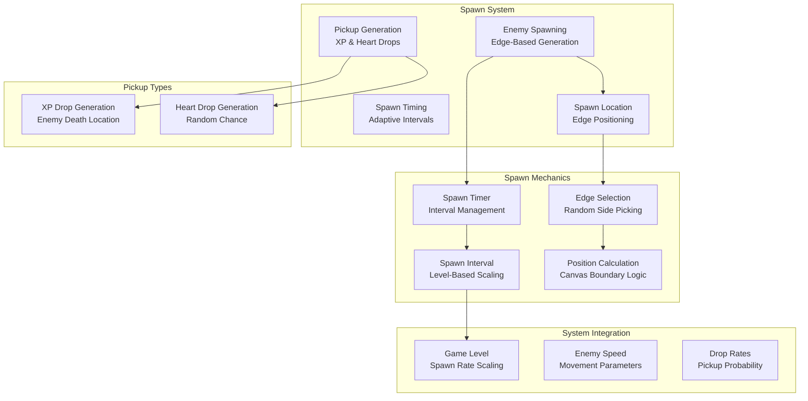
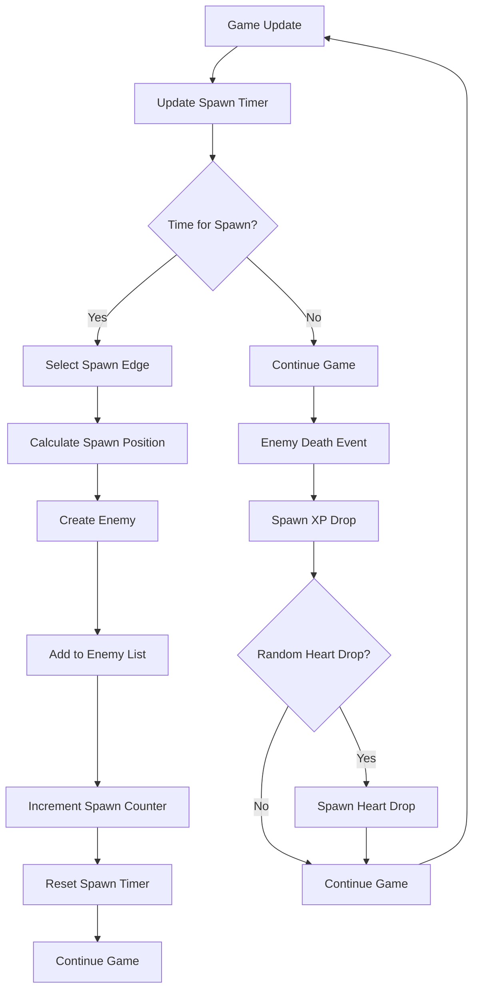

# Spawn System

## 🎯 Overview

BulletBuzz features a dynamic spawn system that manages enemy generation and pickup creation. The system provides engaging gameplay with adaptive spawn rates, edge-based spawning, and intelligent pickup generation that scales with player progression.

## 🏗️ Architecture

### Core Components



### Spawn System Flow



## 🚀 Quick Start

### Basic Usage

```typescript
// Spawn system is automatically managed
game.update(1/60);

// Manual enemy spawning
game.spawnSystem.spawnEnemy();

// Manual pickup spawning
game.spawnSystem.spawnXpDrop(100, 100, 10);
game.spawnSystem.spawnHeartDrop(150, 150);

// Check spawn statistics
console.log(`Enemies spawned: ${game.enemiesSpawned}`);
```

### Spawn Configuration

```typescript
// Spawn system parameters
const spawnConfig = {
  baseSpawnInterval: 2000,    // Base spawn interval in milliseconds
  minSpawnInterval: 500,      // Minimum spawn interval in milliseconds
  enemySpeed: 0.15,           // Enemy movement speed
  heartDropRate: 0.3,         // Heart drop probability (30%)
  xpDropValue: 10,            // XP value per drop
  spawnEdges: true,           // Spawn from canvas edges
  levelScaling: true          // Scale spawn rate with level
};
```

## 👾 Enemy Spawning

### 1. Spawn Timing

The spawn system uses adaptive timing based on game level:

```typescript
public update(): void {
  this.spawnTimer += this.game.timestep;
  
  // Calculate spawn interval based on level (in seconds)
  const spawnInterval = Math.max(
    this.game.minSpawnInterval / 1000, // Convert to seconds
    (this.game.baseSpawnInterval - (this.game.level - 1) * 100) / 1000
  );
  
  // For testing, use a shorter interval
  const testInterval = Math.min(spawnInterval, 0.5); // Max 0.5 seconds for testing
  
  if (this.spawnTimer >= testInterval) {
    this.spawnEnemy();
    this.spawnTimer = 0;
  }
}
```

### 2. Spawn Interval Calculation

The spawn interval decreases as the player levels up:

```typescript
// Base spawn interval: 2000ms (2 seconds)
// Level scaling: -100ms per level
// Minimum interval: 500ms (0.5 seconds)

// Level 1: 2000ms spawn interval
// Level 2: 1900ms spawn interval
// Level 3: 1800ms spawn interval
// Level 4: 1700ms spawn interval
// Level 5: 1600ms spawn interval
// And so on...
```

### 3. Edge-Based Spawning

Enemies spawn from the four edges of the canvas:

```typescript
private spawnEnemy(): void {
  // Spawn from edges
  let x: number, y: number;
  const side = Math.floor(Math.random() * 4);
  
  switch (side) {
    case 0: // Top
      x = Math.random() * this.canvasWidth;
      y = -20;
      break;
    case 1: // Right
      x = this.canvasWidth + 20;
      y = Math.random() * this.canvasHeight;
      break;
    case 2: // Bottom
      x = Math.random() * this.canvasWidth;
      y = this.canvasHeight + 20;
      break;
    default: // Left
      x = -20;
      y = Math.random() * this.canvasHeight;
      break;
  }
  
  const enemy = new Enemy(x, y, this.game.level, this.game.enemySpeed);
  this.game.enemies.push(enemy);
  this.game.enemiesSpawned++;
}
```

### 4. Enemy Creation

Enemies are created with level-appropriate stats:

```typescript
const enemy = new Enemy(x, y, this.game.level, this.game.enemySpeed);
```

**Enemy Parameters:**
- **Position**: Random edge location
- **Level**: Current game level (affects enemy stats)
- **Speed**: Base enemy movement speed
- **HP**: Scales with level
- **Damage**: Scales with level
- **XP Value**: Scales with level

## 🎁 Pickup Generation

### 1. XP Drop Generation

XP drops are spawned at enemy death locations:

```typescript
public spawnXpDrop(x: number, y: number, value: number = 1): void {
  const xpDrop = new XpDrop(x, y, value);
  this.game.xpDrops.push(xpDrop);
}
```

**XP Drop Properties:**
- **Position**: Enemy death location
- **Value**: Configurable XP amount (default: 1)
- **Lifetime**: 10 seconds
- **Attraction**: Moves toward player when in range

### 2. Heart Drop Generation

Heart drops have a random chance to spawn:

```typescript
public spawnHeartDrop(x: number, y: number): void {
  if (Math.random() < this.game.heartDropRate) {
    const heartDrop = new HeartDrop(x, y);
    this.game.heartDrops.push(heartDrop);
  }
}
```

**Heart Drop Properties:**
- **Position**: Enemy death location
- **Chance**: Configurable probability (default: 30%)
- **Heal Amount**: 2 HP per heart
- **Lifetime**: 15 seconds
- **Attraction**: Moves toward player when in range

### 3. Pickup Integration

Pickups are automatically spawned when enemies die:

```typescript
// In collision system when enemy dies
if (enemy.isDead()) {
  // Spawn drops at enemy location
  this.game.spawnSystem.spawnXpDrop(enemy.x, enemy.y, enemy.xpValue);
  this.game.spawnSystem.spawnHeartDrop(enemy.x, enemy.y);
  
  // Remove enemy
  this.game.enemies.splice(j, 1);
  this.game.enemiesKilled++;
}
```

## 📊 Spawn Statistics

### Spawn Parameters

| Parameter | Default | Description | Impact |
|-----------|---------|-------------|--------|
| `baseSpawnInterval` | 2000ms | Base spawn interval | Lower = more frequent spawns |
| `minSpawnInterval` | 500ms | Minimum spawn interval | Prevents excessive spawning |
| `enemySpeed` | 0.15 | Enemy movement speed | Higher = faster enemies |
| `heartDropRate` | 0.3 | Heart drop probability | Higher = more healing |
| `xpDropValue` | 10 | XP per drop | Higher = faster progression |

### Level-Based Scaling

| Level | Spawn Interval | Enemy HP | Enemy Damage | XP Value |
|-------|----------------|----------|--------------|----------|
| **1** | 2000ms | 1 | 1 | 10 |
| **2** | 1900ms | 1 | 1 | 10 |
| **3** | 1800ms | 1 | 1 | 10 |
| **4** | 1700ms | 1 | 1 | 10 |
| **5** | 1600ms | 1 | 1 | 10 |
| **6** | 1500ms | 1 | 1 | 10 |
| **7** | 1400ms | 1 | 1 | 10 |
| **8** | 1300ms | 1 | 1 | 10 |
| **9** | 1200ms | 1 | 1 | 10 |
| **10** | 1100ms | 1 | 1 | 10 |

### Spawn Statistics Tracking

```typescript
// Spawn statistics
this.game.enemiesSpawned++;     // Total enemies spawned
this.game.enemiesKilled++;      // Total enemies killed
this.game.xpCollected += value; // Total XP collected
this.game.heartsCollected++;    // Total hearts collected
```

## 🎨 Visual Rendering

### Spawn Location Indicators

```typescript
// Draw spawn location indicators (for debugging)
ctx.strokeStyle = 'rgba(255, 0, 0, 0.5)';
ctx.lineWidth = 2;

// Top edge
ctx.beginPath();
ctx.moveTo(0, -20);
ctx.lineTo(canvas.width, -20);
ctx.stroke();

// Right edge
ctx.beginPath();
ctx.moveTo(canvas.width + 20, 0);
ctx.lineTo(canvas.width + 20, canvas.height);
ctx.stroke();

// Bottom edge
ctx.beginPath();
ctx.moveTo(0, canvas.height + 20);
ctx.lineTo(canvas.width, canvas.height + 20);
ctx.stroke();

// Left edge
ctx.beginPath();
ctx.moveTo(-20, 0);
ctx.lineTo(-20, canvas.height);
ctx.stroke();
```

### Spawn Statistics Display

```typescript
// Display spawn statistics
ctx.fillStyle = 'white';
ctx.font = '12px serif';
ctx.fillText(`Spawned: ${game.enemiesSpawned}`, 10, 20);
ctx.fillText(`Killed: ${game.enemiesKilled}`, 10, 35);
ctx.fillText(`XP Collected: ${game.xpCollected}`, 10, 50);
ctx.fillText(`Hearts Collected: ${game.heartsCollected}`, 10, 65);
```

## ⚙️ Configuration Options

### Spawn System Parameters

| Parameter | Base Value | Increment | Max Value | Effect |
|-----------|------------|-----------|-----------|--------|
| **Base Spawn Interval** | 2000ms | -100ms | 500ms | Spawn frequency |
| **Enemy Speed** | 0.15 | +0.01 | No limit | Enemy movement speed |
| **Heart Drop Rate** | 0.3 | +0.05 | 1.0 | Healing availability |
| **XP Drop Value** | 10 | +1 | No limit | Progression speed |
| **Level Scaling** | Enabled | N/A | N/A | Dynamic difficulty |

### System Integration

| System | Integration | Description |
|--------|-------------|-------------|
| **Combat System** | Enemy creation | Provides targets for combat |
| **Pickup System** | Drop generation | Creates collectible items |
| **Level System** | Spawn rate scaling | Adjusts difficulty with progression |
| **Player System** | Enemy targeting | Enemies target the player |

## 🧪 Testing

### Unit Tests

```typescript
// Test enemy spawning
test('enemy spawns at edge location', () => {
  const game = new Game();
  const initialEnemyCount = game.enemies.length;
  
  game.spawnSystem.spawnEnemy();
  
  expect(game.enemies.length).toBe(initialEnemyCount + 1);
  
  const enemy = game.enemies[game.enemies.length - 1];
  expect(enemy.x).toBeLessThan(0).or.toBeGreaterThan(game.canvasWidth);
  expect(enemy.y).toBeLessThan(0).or.toBeGreaterThan(game.canvasHeight);
});

// Test pickup spawning
test('XP drop spawns at specified location', () => {
  const game = new Game();
  const x = 100;
  const y = 150;
  const value = 15;
  
  game.spawnSystem.spawnXpDrop(x, y, value);
  
  expect(game.xpDrops.length).toBe(1);
  expect(game.xpDrops[0].x).toBe(x);
  expect(game.xpDrops[0].y).toBe(y);
  expect(game.xpDrops[0].value).toBe(value);
});

// Test heart drop probability
test('heart drop spawns based on probability', () => {
  const game = new Game();
  game.heartDropRate = 0.5; // 50% chance
  
  // Spawn multiple heart drops to test probability
  let heartDropsSpawned = 0;
  for (let i = 0; i < 100; i++) {
    game.spawnSystem.spawnHeartDrop(100, 100);
    if (game.heartDrops.length > heartDropsSpawned) {
      heartDropsSpawned++;
    }
  }
  
  // Should be close to 50% (allowing for randomness)
  expect(heartDropsSpawned).toBeGreaterThan(30);
  expect(heartDropsSpawned).toBeLessThan(70);
});

// Test spawn timing
test('enemies spawn at correct intervals', () => {
  const game = new Game();
  const initialEnemyCount = game.enemies.length;
  
  // Wait for spawn interval
  game.update(game.baseSpawnInterval / 1000);
  
  expect(game.enemies.length).toBeGreaterThan(initialEnemyCount);
});
```

### Integration Tests

```typescript
// Test complete spawn flow
test('enemy death spawns pickups', () => {
  const game = new Game();
  const enemy = new Enemy(150, 150);
  game.enemies.push(enemy);
  
  // Kill enemy
  enemy.takeDamage(enemy.hp);
  game.collisionSystem.update();
  
  expect(game.xpDrops.length).toBeGreaterThan(0);
  // Heart drops are random, so just check if any were created
  expect(game.heartDrops.length).toBeGreaterThanOrEqual(0);
});

// Test level-based spawn scaling
test('spawn rate increases with level', () => {
  const game = new Game();
  const level1Spawns = [];
  const level2Spawns = [];
  
  // Record spawns at level 1
  for (let i = 0; i < 10; i++) {
    game.update(1/60);
    level1Spawns.push(game.enemies.length);
  }
  
  // Level up
  game.level++;
  
  // Record spawns at level 2
  for (let i = 0; i < 10; i++) {
    game.update(1/60);
    level2Spawns.push(game.enemies.length);
  }
  
  // Level 2 should have more spawns (faster spawn rate)
  const level1Total = level1Spawns[level1Spawns.length - 1];
  const level2Total = level2Spawns[level2Spawns.length - 1];
  
  expect(level2Total).toBeGreaterThan(level1Total);
});
```

### Performance Tests

```typescript
// Test spawn system performance
test('spawn system performance with high spawn rate', () => {
  const game = new Game();
  game.baseSpawnInterval = 100; // Very fast spawning
  
  const startTime = performance.now();
  
  // Update spawn system many times
  for (let i = 0; i < 1000; i++) {
    game.update(1/60);
  }
  
  const endTime = performance.now();
  
  // Should complete within reasonable time
  expect(endTime - startTime).toBeLessThan(100); // 100ms
});
```

## 🐛 Troubleshooting

### Common Issues

#### **Enemies Not Spawning**
```typescript
// Check spawn timing
console.log('Spawn timing:', {
  spawnTimer: this.spawnTimer,
  spawnInterval: spawnInterval,
  shouldSpawn: this.spawnTimer >= spawnInterval,
  level: this.game.level,
  baseSpawnInterval: this.game.baseSpawnInterval
});
```

#### **Pickups Not Spawning**
```typescript
// Check pickup spawning
console.log('Pickup spawning:', {
  enemyPosition: { x: enemy.x, y: enemy.y },
  heartDropRate: this.game.heartDropRate,
  randomValue: Math.random(),
  shouldSpawnHeart: Math.random() < this.game.heartDropRate
});
```

#### **Spawn Rate Too High/Low**
```typescript
// Check spawn interval calculation
console.log('Spawn interval:', {
  baseSpawnInterval: this.game.baseSpawnInterval,
  minSpawnInterval: this.game.minSpawnInterval,
  level: this.game.level,
  calculatedInterval: spawnInterval,
  finalInterval: testInterval
});
```

### Debug Mode

```typescript
// Enable spawn system debug mode
const DEBUG_SPAWN_SYSTEM = true;

if (DEBUG_SPAWN_SYSTEM) {
  console.log('Spawn System Debug:', {
    spawnTimer: this.spawnTimer,
    enemiesSpawned: this.game.enemiesSpawned,
    enemiesKilled: this.game.enemiesKilled,
    xpDropsCount: this.game.xpDrops.length,
    heartDropsCount: this.game.heartDrops.length,
    level: this.game.level
  });
}
```

## 🎯 Performance Optimization

### Optimization Strategies

1. **Efficient Spawn Timing**
   ```typescript
   // Use fixed timestep for consistent spawn timing
   public update(): void {
     this.spawnTimer += this.game.timestep;
     
     const spawnInterval = Math.max(
       this.game.minSpawnInterval / 1000,
       (this.game.baseSpawnInterval - (this.game.level - 1) * 100) / 1000
     );
     
     if (this.spawnTimer >= spawnInterval) {
       this.spawnEnemy();
       this.spawnTimer = 0;
     }
   }
   ```

2. **Optimized Edge Selection**
   ```typescript
   // Use bitwise operations for faster edge selection
   private spawnEnemy(): void {
     const side = Math.floor(Math.random() * 4);
     const isHorizontal = side & 1; // 0 or 1
     const isPositive = side & 2;   // 0 or 2
     
     let x: number, y: number;
     
     if (isHorizontal) {
       x = isPositive ? this.canvasWidth + 20 : -20;
       y = Math.random() * this.canvasHeight;
     } else {
       x = Math.random() * this.canvasWidth;
       y = isPositive ? this.canvasHeight + 20 : -20;
     }
     
     const enemy = new Enemy(x, y, this.game.level, this.game.enemySpeed);
     this.game.enemies.push(enemy);
   }
   ```

3. **Efficient Pickup Generation**
   ```typescript
   // Batch pickup creation for better performance
   public spawnPickups(x: number, y: number, xpValue: number): void {
     // Always spawn XP drop
     this.spawnXpDrop(x, y, xpValue);
     
     // Randomly spawn heart drop
     if (Math.random() < this.game.heartDropRate) {
       this.spawnHeartDrop(x, y);
     }
   }
   ```

### Performance Metrics

- **Spawn System Update**: < 0.01ms per frame
- **Enemy Creation**: < 0.001ms per enemy
- **Pickup Generation**: < 0.001ms per pickup
- **Memory Usage**: Minimal object allocation

## 🔮 Future Enhancements

### Planned Features

- [ ] **Spawn Patterns** - Different enemy spawn formations
- [ ] **Boss Spawning** - Special enemies at milestone levels
- [ ] **Spawn Events** - Special spawn conditions
- [ ] **Dynamic Scaling** - Adaptive spawn rates based on performance
- [ ] **Spawn Zones** - Multiple spawn areas

### Technical Debt

- [ ] **TypeScript Types** - Better type definitions for spawn entities
- [ ] **Unit Tests** - Comprehensive test coverage for spawn mechanics
- [ ] **Performance Monitoring** - Real-time spawn system metrics
- [ ] **Configuration System** - Runtime spawn parameter adjustment

## 📚 Related Documentation

- [**Combat System**](combat-system.md) - Enemy targeting and combat
- [**Pickup System**](pickup-system.md) - XP and heart drop mechanics
- [**Level System**](level-system.md) - Spawn rate scaling with level
- [**Enemy System**](../core/Enemy.ts) - Enemy behavior and stats
- [**Event System**](event-system.md) - Spawn event handling

## 🎯 Best Practices

### Spawn Design Principles

1. **Balanced Difficulty** - Appropriate spawn rates for engagement
2. **Clear Patterns** - Obvious spawn locations and timing
3. **Performance Conscious** - Efficient spawn system updates
4. **Scalable Design** - Adapts to player progression
5. **Accessible Gameplay** - Easy to understand spawn mechanics

### Configuration Guidelines

1. **Start Conservative** - Begin with lower spawn rates
2. **Test Balance** - Ensure spawns provide appropriate challenge
3. **Monitor Performance** - Track spawn system efficiency
4. **Iterate Design** - Refine based on player feedback
5. **Document Changes** - Keep track of spawn adjustments

---

*Last updated: 2025-07-31*
*Spawn System Version: 1.0* 