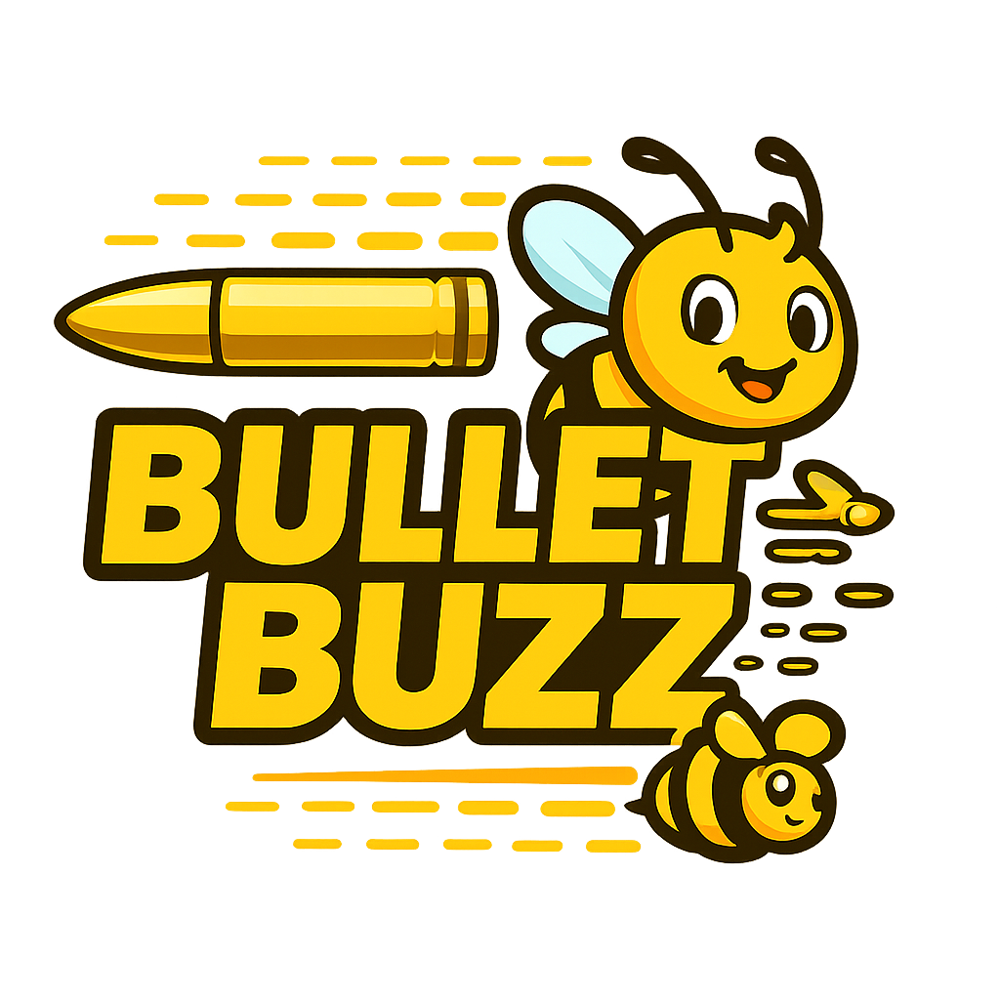

# 🎮 BulletBuzz

{ width="150" }

## 🚀 Quick Start

**🎮 [Play BulletBuzz Game](https://tjsingleton.github.io/bulletbuzz/game/)**

**📖 [View Documentation](https://tjsingleton.github.io/bulletbuzz/)**

**🎮 Development Mode**: Add `?speed=10` to the URL for 10x game speed!

## 🎯 What is BulletBuzz?

BulletBuzz is a bullet heaven game inspired by Brotato and Vampire Survivors, where you survive waves of enemies in an endless arena. The game features:

- **🧠 Advanced AI**: Intelligent auto-pathing with wall avoidance and smart targeting
- **⚔️ Bullet Heaven**: Survive waves of enemies in an endless arena
- **🎨 Modern UI**: Professional shop modals and detailed game over screens
- **🧪 Testing**: Comprehensive unit tests and automated screenshot testing

## 🏗️ Architecture

### Technology Stack

- **TypeScript**: Type-safe game development
- **HTML5 Canvas**: Game rendering
- **ES Modules**: Modern JavaScript modules
- **Node.js**: Headless testing environment
- **Jest**: Unit testing framework
- **Playwright**: Automated browser testing and screenshots

### Core Systems

- **Game Loop**: Fixed timestep implementation for consistent updates
- **AI System**: Auto-pathing with wall avoidance and target tracking
- **Combat System**: Automatic axe throwing and collision detection
- **Pickup System**: XP and heart collection with attraction mechanics
- **Level System**: XP progression and shop management
- **Spawn System**: Dynamic enemy and pickup generation

## 🎮 Game Features

### 🧠 Advanced AI

- **Auto-Pathing**: Intelligent movement with wall avoidance and target tracking
- **Combat AI**: Smart targeting within attack range with automatic axe throwing
- **Pickup Attraction**: XP orbs and hearts attract to player within pickup range
- **Robot Vacuum Mode**: Efficient pickup collection with pathfinding to drops

### ⚔️ Gameplay Mechanics

- **Bullet Heaven**: Survive waves of enemies in an endless arena
- **XP System**: Level up to unlock new abilities with accurate progress tracking
- **Pickup System**: Collect hearts and XP drops with attraction mechanics
- **Shop System**: Choose upgrades between levels with auto-shop option
- **Difficulty Scaling**: Progressive challenge increase with dynamic spawn rates

### 🎨 Enhanced UI

- **Professional Shop Modal**: Button-like options with sequential numbering
- **Detailed Game Over Screen**: Comprehensive statistics with skull emoji
- **Real-time Stats**: Live player and enemy statistics
- **Range Visualization**: Attack and pickup range circles
- **XP Progress Bar**: Visual progress tracking

## 📊 Game Balance

### Current Settings

- **Player**: 10 HP, 0.85 speed, 25 pickup range, 150 attack range
- **Enemies**: 0.15 speed, 8s spawn interval
- **Auto-Pathing**: 120 avoidance distance, 2.0 strength
- **Difficulty**: Single enemy until level 6, 15% scaling
- **Shop**: Appears after every level with 3 random options

---

**Made with ❤️ by @tjsingleton** 